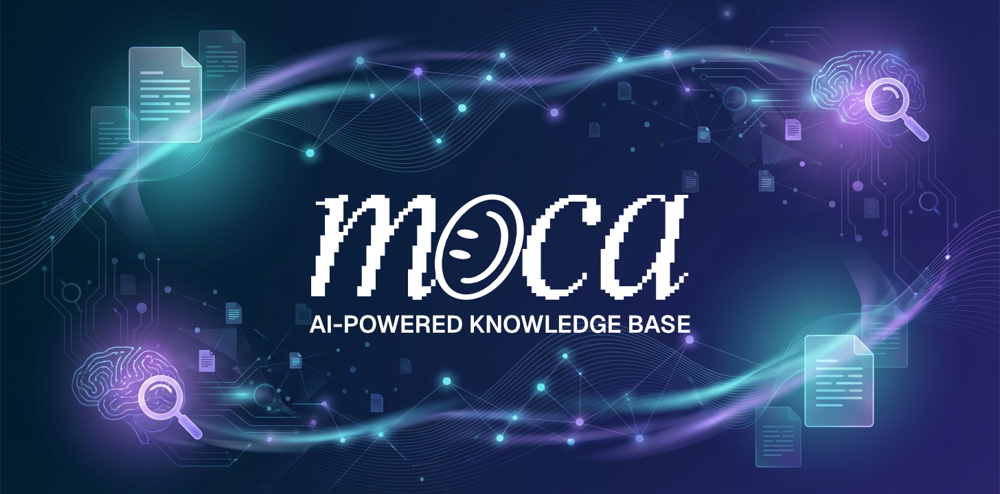

<div align="center">



# 🧠 Cortex

**The Agentic Knowledge Base for the AI Era**


</div>

## 🚀 What is Cortex?

In a world where AI evolves at breakneck speed and agent frameworks rise and fall overnight, your knowledge shouldn't be locked into any single system. **Cortex** is an agentic knowledge base that ingests your documents and analyzes their contents via LLM-assisted workflows, enabling bleeding-edge understanding of any content you throw at it.

The LLM-driven system automatically extracts entities and builds relationships between them, creating a **scalable knowledge graph** that grows smarter with every document. This graph is exposed via API, ready to be integrated into Q+A interfaces, enrich your agents' understanding, or serve as the long-term memory backbone for your entire AI stack.

### 💡 Why Cortex?

Think of the memory hierarchy in your AI systems:
- **Context** = Short-term memory
- **Agent Memory Stack** = Mid-term memory
- **Cortex** = Long-term memory (survives crashes, redeployments, and even framework migrations)

Cortex sits at the center of your setup. Curate your base knowledge in the default collection, continuously push short-term learnings into specialized buckets, and let the system rebuild the graph nightly to propagate updated knowledge across all your agents and apps. Every agent—whether prompted or autonomously executing—can selectively pull knowledge from available buckets to better serve itself and your users.

The beauty? Your data isn't trapped. When a hot new agent framework drops next month, just wait for an official plugin OR write a migration script and connect your existing knowledge graph to the new system. **Your agents' memories become portable.**

> **💡 Pro Tip:** Use the built-in **Web Import** feature (*MDHarvest powered by Crawl4ai*) to turn any URL into beautifully formatted Markdown and ingest it straight into your graph — point Cortex at a [crawl4ai](https://github.com/unclecode/crawl4ai) service and paste or discover the links you want. See the [Web Import guide](handbook/23-web-import.md).

## ✨ Features

### Core Features
- **📁 Document Upload**: Support for PDF, TXT, Markdown, DOCX, and XLSX files with source tracking for API integrations
- **✏️ Custom Inputs**: Manually add Q&A pairs, text, or markdown without file uploads
- **🌐 Web Import** (*MDHarvest powered by Crawl4ai*): Harvest web pages into clean markdown and ingest them into the graph. Paste URLs or **discover** the links on a page and pick which to pull. Cortex never embeds a browser — it calls a self-hosted or shared [crawl4ai](https://github.com/unclecode/crawl4ai) service over HTTP, so one crawler instance serves many deployments. Off by default (`ENABLE_WEB_CRAWL=true` + `CRAWL_SERVICE_URL`).
- **🔍 Hybrid Search**: Semantic + keyword search with Reciprocal Rank Fusion (RRF)
- **💬 AI Q&A**: Ask questions and get AI-generated answers with sources
- **🔗 Graph Storage**: Documents stored as interconnected nodes in Neo4j
- **⚡ Vector Search**: Fast similarity search using Neo4j's vector index
- **🎨 Modern UI**: Beautiful, responsive interface with unified navigation:
  - **Manage**: Documents, Knowledge Graph (one-click "Generate Graph" pipeline: entity extraction & relation discovery → cross-document deep relationship analysis → detect communities; "Regenerate Graph" deletes all communities, cross-document relations, and entities for a from-scratch rebuild while preserving per-chunk relations during Step 2 rebuild), Entity Deduplication, Collections, Add
  - **Explore**: Knowledge Graph, Entities, Relationships, Communities, Deep Research, Chat

### GraphRAG Features
- **🧠 GraphRAG**: LLM-powered entity extraction with per-chunk relationship extraction during ingestion (with retry and exponential backoff for rate limits, canonical name remapping, and self-referential filtering), plus cross-document deep relationship analysis — default `targeted` mode generates candidate pairs without the LLM (entity-embedding kNN + document co-mention) and verifies them in small batched LLM calls; legacy `llm_scan` mode runs the two-phase full-batch scan (candidate scanning with few-shot examples → confidence-scored XML extraction) — for knowledge graph construction. Stats endpoint returns `per_chunk_relationship_count` separately so the UI can distinguish Step 1 relations vs cross-document relations. Dedicated relationship model with separate rate limiting from entity extraction (fallback: relationship → extraction → primary).
- **🔄 Hybrid Retrieval**: Combines vector similarity, keyword search, and graph traversal
- **🎯 Re-ranking**: Cross-encoder re-ranking for improved precision
- **💭 Conversation Memory**: Multi-turn conversations with context retention
- **🚀 Streaming Responses**: Real-time answer generation with SSE
- **🔬 Deep Research Mode**: Agentic multi-step RAG for complex questions

### Advanced Features
- **🌐 Community Detection**: Automatic grouping of related entities using Leiden/Louvain algorithms with weight-aware, undirected graph projection and co-mention edges
- **📝 Community Summarization**: LLM-generated summaries for entity communities using the extraction model, with assistant prefill for reliable JSON output
- **🔮 Extended Thinking**: Visible reasoning chains during agentic RAG (stream thinking)
- **📂 Collection-Level Graphs**: Organize documents into collections with scoped knowledge graphs
- **🎯 Semantic Entity Resolution**: Embedding-based vector similarity deduplication (with Levenshtein 85% fallback) during entity extraction with alias tracking and proper document provenance tracking (`source_documents`, `extraction_count`) — catches semantic matches like "Museum of Crypto Art" / "MOCA" that string similarity misses
- **🔀 Entity Deduplication**: Post-extraction duplicate scanning using multi-strategy fuzzy matching (rapidfuzz) with Person-aware name gating (word-prefix validation prevents false matches on shared first names), entity-level deduplicate button in Explore for quick access, inspect modal for reviewing entity details before merging, LLM-generated combined descriptions, review-and-merge UI, inline entity search, and full merge history with audit trail
- **🔄 Targeted Relationship Discovery**: Default Step 2 engine (`RELATIONSHIP_DISCOVERY_MODE=targeted`) generates candidate entity pairs without the LLM — entity-embedding kNN over a Neo4j vector index (missing embeddings backfilled automatically) plus document co-mention — then verifies them in small batched LLM calls (~40 pairs/call), scaling efficiently on large graphs. Legacy `llm_scan` mode keeps the multi-round full-batch scan (up to `RELATIONSHIP_MAX_ROUNDS` rounds, stopping early at the target Entity-Relationship Ratio). Anti-hub protections in both modes: per-entity relationship cap (`RELATIONSHIP_MAX_PER_ENTITY`), candidate caps and doc-frequency hub guard (targeted), degree-aware batching and evidence-based prompts (legacy). Supports incremental (build on existing) and rebuild (delete cross-document relations, preserving per-chunk relations) modes.
- **📈 ERR Metric**: Entity-Relationship Ratio displayed on the Knowledge Graph page (2 decimal places) with color-coded health indicator
- **📊 Explore Browsers**: Entities, relationships, and communities browsers load all items for full-dataset search, with type filters and detail modals
- **⏱️ Progress Tracking**: Real-time batch progress with ETA for relationship analysis and community detection
- **📤 Library Import/Export**: Export your entire library (documents, knowledge graph, embeddings, communities) as a portable ZIP archive and import it into another instance — no need to re-run the expensive knowledge graph pipeline
- **🧩 Agent Skills**: Extend Deep Research and Chat with live API connections from the open [AgentSkills](https://agentskills.io/) ecosystem. Install skills from [skills.sh](https://skills.sh) or direct URLs — a setup wizard auto-detects required configuration (API tokens, etc.) and prompts you to provide them. Enabled skills are automatically activated at the start of every session. The researcher agent uses the built-in `http_request` tool to call external APIs described in skill instructions, with authentication injected server-side from stored configuration.
- **🔗 Git Integration**: Connect **GitHub, GitLab, and Gitea** repositories (including self-hosted) as a living knowledge source. Cortex ingests a repo's files and wiki into the knowledge graph and keeps them in sync **incrementally** via git history (added / modified / deleted / renamed), with a curated `.pdf`/`.md`-only default and custom glob filters. The whole connector is **off by default** — an admin turns it on with `ENABLE_GIT_INTEGRATION=true`, which enables ingestion *and* the agent capability. Each connection is then **read-only (ingest)** unless you grant **read/write**, in which case the research agent gains a `git_repo` tool that opens **pull requests** for your review (never a direct push). Per-connection access tokens, manual or scheduled sync.

### Security & Performance Features
- **🛡️ Prompt Security**: Protection against prompt injection attacks with configurable detection
- **🔐 Collection-Scoped API Keys**: Restrict API keys to specific collections — one instance, multiple isolated tenants. Both `read` and `read+write` keys support collection scoping. Restricted keys automatically receive filtered results across all endpoints — documents, collections, graph entities, relationships, communities, stats, and search — using the 4-hop `Collection→Document→Chunk→Entity` pattern. Out-of-scope single-resource requests return 403. New collections require explicit access grants.
- **📦 Bulk Upload**: Upload hundreds of files with batch processing and progress tracking
- **📥 Bulk Download**: Download selected documents as a ZIP archive (ZIP64, supports 1000+ files)
- **📊 Background Tasks**: Long-running operations with real-time progress polling
- **🧹 Smart Cleanup**: Automatic task cancellation and complete graph cleanup on document deletion
- **⚡ Opt-in Efficiency Flags**: UNWIND-batched graph writes, chunk-batched relationship extraction (÷~4 LLM calls), Phase-B crash-resume checkpointing, unchanged-document reprocess skip, and provider prompt caching — all flag-gated with bench-validated rollout (see the [configuration docs](documentation/pages/configuration.mdx) and `bench/BASELINE.md`)
- **🩺 Production Operations**: Prometheus `GET /metrics` (admin-protected), optional JSON logs with `X-Request-ID` correlation, per-key rate limiting, graceful shutdown with SSE drain, per-service memory caps, an opt-in backup sidecar (`docker-compose.backup.yml`), and a **slim torch-free image variant** (`INSTALL_LOCAL_ML=false`) for stacks backed by the shared `cortex-helper`
- **🔭 LLM Observability (optional)**: point `LANGFUSE_*` at a self-hosted [Langfuse](https://langfuse.com) instance to trace every LLM/embedding/vision call (cost, tokens, latency, errors) and group agentic Q&A flows into one trace per request — Venice/OpenRouter included. Env-driven; no keys = no tracing, identical image. Prompt/completion content is **redacted by default** (privacy-first); set `LANGFUSE_LOG_EXTENDED=true` to log full text for debugging. See [`.claude/domain/observability.md`](.claude/domain/observability.md)

## 🏗️ Architecture

```
┌─────────────────┐     ┌─────────────────┐     ┌─────────────────┐
│                 │     │                 │     │                 │
│   Next.js UI    │────▶│  FastAPI +      │────▶│     Neo4j       │
│   (TypeScript)  │     │  Haystack       │     │   (Graph + Vec) │
│                 │     │  (Python)       │     │                 │
└─────────────────┘     └─────────────────┘     └─────────────────┘
```

### Components

| Component | Technology | Purpose |
|-----------|------------|---------|
| Frontend | Next.js 15 + React 19 + TypeScript | Document management, graph exploration, Q&A interface |
| Backend | FastAPI + Haystack 2.0 | Document processing, embeddings, RAG |
| Database | Neo4j 5.x | Graph storage + vector similarity search |
| Embeddings | OpenAI / sentence-transformers | Convert text to semantic vectors |

## 🚀 Quick Start

### Prerequisites

- Docker & Docker Compose
- Node.js 20+ (for local development)
- Python 3.11+ (for local development)

### Development Mode

1. **Clone and setup environment**

```bash
git clone https://github.com/mocaOS/cortex-app.git
cd cortex-app

# Copy environment template
cp .env.example .env
```

2. **Configure environment variables**

Edit `.env` with your settings:

```env
NEO4J_USER=neo4j
NEO4J_PASSWORD=password123

# Admin Authentication
ADMIN_EMAIL=admin@example.com
ADMIN_PASSWORD=your-secure-password
ADMIN_API_KEY=cortex_admin_your-secret-key
SESSION_SECRET=at-least-32-characters-secret
```

3. **Configure LLM providers**

Cortex uses LLMs for Q&A, entity extraction, relationship analysis, community summarization, and image understanding. Each capability can point to a different model or provider (any OpenAI-compatible API). Entity extraction and community summarization use the extraction model, while all relationship work (per-chunk + batch analysis) uses the dedicated relationship model. Fallback chain: relationship model → extraction model → primary model.

**Quick Setup: Recommended Minimal Stack** — if you want the bench-validated 2-model stack, fill in two API values and you're done. Everything else inherits via the model + budget fallback chains. The two `*_MAX_CONTEXT` lines unlock each model's full input window (defaults are too conservative for these models).

```env
# Primary — agentic Q&A / researcher (Gemma4 26B A4B: fast MoE, 256K context window)
OPENAI_API_KEY=
OPENAI_API_BASE=https://api.venice.ai/api/v1
OPENAI_MODEL=google-gemma-4-26b-a4b-it
OPENAI_MAX_CONTEXT=256000

# Extraction — drives relationship via inheritance (Qwen3.6 27B: 256K window)
GRAPH_EXTRACTION_MODEL=qwen3-6-27b
GRAPH_EXTRACTION_MAX_CONTEXT=256000

# Vision — image analysis. VISION_MODEL must be set explicitly (the model name does NOT
# inherit) — leave it empty and vision analysis is disabled (falls back to Docling's
# built-in capabilities). Only api_base/api_key inherit from OPENAI_* when unset.
VISION_MODEL=qwen3-6-27b

# Embeddings — text embedding model (Qwen3-Embedding-8B: native 4096, MRL 32–4096)
EMBEDDING_MODEL=text-embedding-qwen3-8b
EMBEDDING_DIMENSION=4096            # Native dimension; Neo4j 5.26 (default) supports up to 4096-dim vector indexes
# EMBEDDING_MAX_INPUT_TOKENS defaults to 8192 — Venice/OpenAI cap inputs at 8192 server-side.
# Self-hosted vLLM users can lift to 32768 to use Qwen3-Embedding-8B's full native context.
```

Or configure each tier explicitly:

```env
# ── Primary LLM (Q&A, research, chat) ───────────────────────────
# Recommended: Gemma4 26B A4B (google-gemma-4-26b-a4b-it) — blazing-fast MoE, ideal for retrieval
# (MiniMax M3 can give slightly better results but costs the system its snappiness — not a worthwhile tradeoff)
OPENAI_API_KEY=
OPENAI_API_BASE=https://api.example.com/v1
OPENAI_MODEL=

# ── Graph Extraction (entity extraction + community summarization) ─
# Qwen3.6 27B recommended — its reasoning is suppressed so it behaves like a fast instruct model that solves the task without overthinking
ENABLE_GRAPH_EXTRACTION=                     # true = extract entities/relationships, false = skip
GRAPH_EXTRACTION_MODEL=                      # defaults to OPENAI_MODEL
GRAPH_EXTRACTION_API_BASE=                   # defaults to OPENAI_API_BASE
GRAPH_EXTRACTION_API_KEY=                    # defaults to OPENAI_API_KEY

# ── Relationship Model (per-chunk + cross-document analysis) ─────
# Qwen3.6 27B recommended — its reasoning is suppressed so it behaves like a fast instruct model that solves the task without overthinking
RELATIONSHIP_EXTRACTION_MODEL=               # defaults to GRAPH_EXTRACTION_MODEL
RELATIONSHIP_EXTRACTION_API_BASE=            # defaults to GRAPH_EXTRACTION_API_BASE
RELATIONSHIP_EXTRACTION_API_KEY=             # defaults to GRAPH_EXTRACTION_API_KEY

# Token budgets — primary defaults cascade to sub-tiers via the fallback chain
# (set sub-tier to 0 = inherit). See "Budget Fallback Chain" further below.
OPENAI_MAX_OUTPUT_TOKENS=8000                # primary output cap; sub-tiers inherit
OPENAI_MAX_CONTEXT=32768                     # primary input context; sub-tiers inherit
# EXTRACTION_MAX_OUTPUT_TOKENS=3500          # bump for verbose-XML models (Qwen3)
# RELATIONSHIP_BATCH_MAX_OUTPUT_TOKENS=16000 # Phase 2 batch (standalone, NOT in chain)

# Context budgets — only override when sub-tier model has bigger window than primary
GRAPH_EXTRACTION_MAX_CONTEXT=256000                # must match GRAPH_EXTRACTION_MODEL context window
RELATIONSHIP_MAX_CONTEXT=196608              # must match RELATIONSHIP_EXTRACTION_MODEL context window

# Reasoning Control (lets you use reasoning models for ingestion with thinking OFF)
# off | minimal | auto | low | medium | high. No-op for pure instruct models.
EXTRACTION_REASONING_MODE=off                # extraction, summaries, communities
RELATIONSHIP_REASONING_MODE=off              # candidate scan + relationship extraction
VISION_REASONING_MODE=off                    # vision-model image descriptions
DEFAULT_REASONING_MODE=off                   # chat path: thinking off → snappy first token, no empty answers (deep-research stays AUTO)
# REASONING_MODEL_OVERRIDES=gpt-5.8:none,custom:minimal  # escape hatch for novel models

# ── Vision (image analysis during document ingestion) ────────────
VISION_MODEL=
VISION_MODEL_API_BASE=                       # defaults to OPENAI_API_BASE
VISION_MODEL_API_KEY=                        # defaults to OPENAI_API_KEY
# VISION_MAX_OUTPUT_TOKENS=0                 # 0 = inherit RELATIONSHIP → EXTRACTION → OPENAI

# ── Embeddings ───────────────────────────────────────────────────
EMBEDDING_MODEL=
EMBEDDING_DIMENSION=
EMBEDDING_SEND_DIMENSIONS=true               # set false for models with fixed output dim
EMBEDDING_API_BASE=                          # defaults to OPENAI_API_BASE
EMBEDDING_API_KEY=                           # defaults to OPENAI_API_KEY
```

**Performance tuning** — controls how much work runs in parallel:

```env
BATCH_PROCESSING_CONCURRENCY=2               # documents processed in parallel
CONCURRENT_EXTRACTIONS=3                     # entity extraction thread pool size
CONCURRENT_RELATIONS=3                       # relationship extraction thread pool size (separate from entity extraction)
VISION_MAX_CONCURRENT=3                      # concurrent vision API calls (system-wide)
PARALLEL_RELATIONSHIP_BATCHES=5              # relationship analysis batches in parallel (0 = use CONCURRENT_RELATIONS)
```

> `BATCH_PROCESSING_CONCURRENCY` controls how many documents go through the pipeline simultaneously. Within each document, `CONCURRENT_EXTRACTIONS` sizes the entity extraction thread pool and `CONCURRENT_RELATIONS` sizes the relationship extraction thread pool (separate rate limits). `VISION_MAX_CONCURRENT` independently caps the background image analysis pipeline across all documents. `PARALLEL_RELATIONSHIP_BATCHES` controls relationship analysis parallelism — set to `0` to use `CONCURRENT_RELATIONS`, or set an explicit number (default: `5`).

4. **Start with Docker Compose**

```bash
docker compose up -d
```

5. **Access the application**

- Frontend: http://localhost:3000
- Backend API: http://localhost:8000
- Neo4j Browser: http://localhost:7474

### Local Development (without Docker)

**Backend:**

```bash
cd backend

# Create virtual environment
python -m venv venv
source venv/bin/activate  # or `venv\Scripts\activate` on Windows

# Install dependencies
pip install -r requirements.txt

# Start Neo4j (via Docker)
docker run -d \
  --name neo4j \
  -p 7474:7474 -p 7687:7687 \
  -e NEO4J_AUTH=neo4j/password123 \
  -e NEO4J_ACCEPT_LICENSE_AGREEMENT=yes \
  neo4j:5.26-enterprise

# Run the API
uvicorn app.main:app --reload --port 8000
```

**Frontend:**

```bash
cd frontend

# Install dependencies
npm install

# Run development server
npm run dev
```

## 📖 API Endpoints

### Core Endpoints

| Method | Endpoint | Description |
|--------|----------|-------------|
| GET | `/health` | Health check |
| GET | `/api/stats` | Knowledge base statistics (includes entity/relationship counts, `per_chunk_relationship_count` for Step 1 relations) |
| GET | `/api/instance/status` | Redeploy-safety snapshot — `safe_to_redeploy` plus in-flight processing/tasks/AskAI activity and last-activity timestamps (`manage` permission). On startup, documents left in `processing`/`extracting` by a prior shutdown are reset to `pending`, so the snapshot no longer reports `safe_to_redeploy: false` forever after a redeploy |
| POST | `/api/upload` | Upload a document (supports `start_processing` and `collection_id` params) |
| GET | `/api/documents` | List all documents |
| GET | `/api/documents/{id}` | Get document details |
| GET | `/api/documents/{id}/content` | Get document with full chunk content |
| GET | `/api/documents/{id}/file` | Serve original uploaded file (inline viewing for PDF, download for others) |
| DELETE | `/api/documents/{id}` | Delete a document (cancels processing, cleans up graph) |
| POST | `/api/documents/delete` | Bulk delete multiple documents (cancels all processing) |
| DELETE | `/api/documents` | Delete ALL documents (cancels all tasks, cleans entire graph) |
| POST | `/api/search` | Semantic search |
| POST | `/api/ask` | Enhanced GraphRAG Q&A (hybrid search, reranking, agentic mode) |
| POST | `/api/ask/stream` | Streaming GraphRAG Q&A with SSE |

### Custom Input Endpoints

| Method | Endpoint | Description |
|--------|----------|-------------|
| POST | `/api/custom-input` | Create a custom input (Q&A, text, or markdown) |
| POST | `/api/custom-input/generate-topic` | Generate a topic/title hint from content using LLM (requires manage permission) |
| GET | `/api/custom-inputs` | List all custom inputs |
| GET | `/api/custom-inputs/{id}` | Get custom input details |

### Bulk Upload & Batch Processing Endpoints

| Method | Endpoint | Description |
|--------|----------|-------------|
| GET | `/api/documents/pending` | List documents waiting to be processed |
| POST | `/api/documents/process-pending` | Start batch processing of pending documents |
| POST | `/api/documents/{id}/reprocess` | Reprocess a single document |
| POST | `/api/documents/reprocess` | Bulk reprocess multiple documents |
| POST | `/api/documents/move` | Move documents to a different collection |
| POST | `/api/cleanup/orphaned-entities` | Clean up orphaned entities and communities from graph |

### Background Task Endpoints

| Method | Endpoint | Description |
|--------|----------|-------------|
| GET | `/api/tasks` | List all background tasks |
| GET | `/api/tasks/{id}` | Get task status and progress |
| GET | `/api/tasks/{id}/result` | Get completed task results |
| DELETE | `/api/tasks/{id}` | Cancel/remove a task |
| POST | `/api/tasks/cleanup` | Remove old completed tasks |

### GraphRAG Endpoints

| Method | Endpoint | Description |
|--------|----------|-------------|
| GET | `/api/graph/status` | GraphRAG system status |
| GET | `/api/graph/visualization` | Get graph data for visualization (supports `limit`, `include_neighbors`) |
| GET | `/api/graph/entities` | List entities in the knowledge graph |
| GET | `/api/graph/entity/{name}` | Get entity details and relationships |
| PATCH | `/api/graph/entity/{name}` | Update entity name and/or description |
| GET | `/api/graph/entity/{name}/relationships` | Get entity relationships up to N hops |
| POST | `/api/graph/subgraph` | Get subgraph for specific entities |
| GET | `/api/graph/search` | Search entities by name (supports prefix matching with wildcard) |
| DELETE | `/api/graph/entities` | Delete ALL entities and their connections (DETACH DELETE) |

### Entity Deduplication Endpoints

| Method | Endpoint | Description |
|--------|----------|-------------|
| GET | `/api/entities/duplicates` | Scan for duplicate entities using multi-strategy fuzzy matching |
| POST | `/api/entities/merge` | Merge duplicate entities with LLM-generated combined description |
| GET | `/api/entities/merge-history` | Get merge history with audit trail |

### Collection Endpoints

| Method | Endpoint | Description |
|--------|----------|-------------|
| GET | `/api/collections` | List all collections |
| POST | `/api/collections` | Create a new collection |
| GET | `/api/collections/{id}` | Get collection details with stats |
| DELETE | `/api/collections/{id}` | Delete a collection |
| POST | `/api/collections/{id}/documents/{doc_id}` | Add document to collection |
| GET | `/api/collections/{id}/entities` | Get entities in collection's graph |

### Relationship Analysis Endpoints

| Method | Endpoint | Description |
|--------|----------|-------------|
| POST | `/api/graph/relationships/analyze` | Cross-document relationship analysis. Default `targeted` mode: kNN + co-mention candidate pairs verified by the LLM in small batched calls (single pass). Legacy `llm_scan` mode: Phase 1 scans candidate pairs, Phase 2 confirms with XML output, multi-round up to `RELATIONSHIP_MAX_ROUNDS`. Params: `rebuild=true` deletes cross-document (batch) relations while preserving per-chunk relations. |
| DELETE | `/api/graph/relationships` | Delete ALL entity relationships |

### Community Detection Endpoints

| Method | Endpoint | Description |
|--------|----------|-------------|
| GET | `/api/graph/communities` | List detected communities |
| POST | `/api/graph/communities/detect` | Run community detection algorithm |
| GET | `/api/graph/communities/{id}` | Get community details |
| DELETE | `/api/graph/communities/{id}` | Delete a specific community (unlinks entities) |
| DELETE | `/api/graph/communities` | Delete ALL communities (unlinks entities) |
| POST | `/api/graph/communities/summarize` | Generate community summaries |
| GET | `/api/graph/communities/search` | Search communities by content |

### Extended Thinking Endpoints

| Method | Endpoint | Description |
|--------|----------|-------------|
| POST | `/api/ask/stream/thinking` | Streaming RAG with visible reasoning |

### Admin Endpoints

| Method | Endpoint | Description | Auth |
|--------|----------|-------------|------|
| GET | `/api/admin/config` | System configuration (model names, API base URLs, context windows — no secrets) | Admin |
| POST | `/api/admin/reset` | System reset — selective deletion of all data | Admin |
| GET | `/api/admin/api-keys` | List all API keys (includes `collection_scope`, `allowed_collections`) | Admin |
| POST | `/api/admin/api-keys` | Create new API key (supports `collection_scope` + `allowed_collections`) | Admin |
| GET | `/api/admin/api-keys/{id}` | Get API key details (includes `allowed_collection_names`) | Admin |
| PATCH | `/api/admin/api-keys/{id}` | Update API key (name, permissions, is_active, collection_scope, allowed_collections) | Admin |
| DELETE | `/api/admin/api-keys/{id}` | Delete API key | Admin |
| POST | `/api/admin/api-keys/{id}/revoke` | Revoke API key | Admin |
| POST | `/api/admin/api-keys/{id}/activate` | Reactivate API key | Admin |

> **Authentication**: All endpoints except `/health` require an `X-API-Key` header. The admin API key has full access. Generated API keys can have `read` (Ask AI, search, view graph/stats) or `manage` (upload, delete, reprocess, run analysis) permissions, and can optionally be **restricted to specific collections** — enabling multi-tenant deployments from a single instance. Collection-scoped keys automatically receive filtered results across all graph, entity, community, and stats endpoints using the 4-hop `Collection→Document→Chunk→Entity` pattern.

### Example: Search

```bash
curl -X POST http://localhost:8000/api/search \
  -H "Content-Type: application/json" \
  -H "X-API-Key: your-api-key" \
  -d '{"query": "What is machine learning?", "top_k": 5}'
```

### Example: GraphRAG Ask

```bash
curl -X POST http://localhost:8000/api/ask \
  -H "Content-Type: application/json" \
  -d '{
    "question": "Explain the main concepts from the documents",
    "use_graph": true,
    "max_hops": 2,
    "use_reranking": true,
    "use_agentic": false
  }'
```

### Example: Deep Research Mode

```bash
curl -X POST http://localhost:8000/api/ask \
  -H "Content-Type: application/json" \
  -d '{
    "question": "Compare the different approaches and their trade-offs",
    "use_agentic": true,
    "conversation_history": [
      {"role": "user", "content": "What is machine learning?"},
      {"role": "assistant", "content": "Machine learning is..."}
    ]
  }'
```

### Example: Collection-Scoped Ask

Scope your question to a specific collection so only its documents, chunks, and entities are searched:

```bash
curl -X POST http://localhost:8000/api/ask \
  -H "Content-Type: application/json" \
  -d '{
    "question": "Summarize the key findings",
    "collection_id": "research-papers",
    "use_graph": true,
    "use_reranking": true
  }'
```

Collection scoping works with all modes — streaming, deep research, and fast search.

### Example: Streaming Response

```bash
curl -X POST http://localhost:8000/api/ask/stream \
  -H "Content-Type: application/json" \
  -d '{"question": "Summarize the key points"}'
```

### Example: Fast Search Mode

Optimized for speed with simple vector search (no hybrid/reranking):

```bash
curl -X POST http://localhost:8000/api/ask/stream \
  -H "Content-Type: application/json" \
  -d '{
    "question": "What is the main topic?",
    "use_fast_search": true
  }'
```

### Example: Extended Thinking Stream

Stream the agent's reasoning process in real-time:

```bash
curl -X POST http://localhost:8000/api/ask/stream/thinking \
  -H "Content-Type: application/json" \
  -d '{
    "question": "What are the relationships between the main concepts?",
    "use_agentic": true
  }'
```

Response events:
```json
{"thinking": "Analyzing question complexity..."}
{"thinking": "Identified 2 research areas"}
{"sub_questions": ["What are the main concepts?", "How are they related?"]}
{"thinking": "Searching knowledge graph communities..."}
{"thinking": "Researching (1/2): What are the main concepts?..."}
{"retrieval": "Found 5 sources for sub-question 1"}
{"sources": [...]}
{"graph_context": {"entities": [...], "communities": [...]}}
{"content": "Based on the analysis..."}
{"done": true, "communities_used": [1, 3]}
```

### Example: Create and Use Collections

```bash
# Create a collection
curl -X POST http://localhost:8000/api/collections \
  -H "Content-Type: application/json" \
  -d '{"name": "Research Papers", "description": "ML research papers"}'

# Upload document to collection
curl -X POST "http://localhost:8000/api/upload?collection_id=<collection-id>" \
  -F "file=@paper.pdf"

# Get collection entities
curl http://localhost:8000/api/collections/<collection-id>/entities

# Ask AI scoped to this collection
curl -X POST http://localhost:8000/api/ask \
  -H "Content-Type: application/json" \
  -d '{
    "question": "What are the main findings?",
    "collection_id": "<collection-id>"
  }'
```

### Example: Collection-Scoped API Keys (Multi-Tenancy)

Restrict an API key to specific collections so it can only see and write to those collections. One Cortex instance, fully isolated tenants:

```bash
# Create a read-only key for Tenant A scoped to their collection
curl -X POST http://localhost:8000/api/admin/api-keys \
  -H "X-API-Key: your-admin-key" \
  -H "Content-Type: application/json" \
  -d '{
    "name": "Tenant A - Read Only",
    "permissions": ["read"],
    "collection_scope": "restricted",
    "allowed_collections": ["<tenant-a-collection-id>"]
  }'

# That key can only see its own collection
curl -H "X-API-Key: cortex_ro_..." http://localhost:8000/api/collections
# → returns only Tenant A's collection

# It gets a 403 for any other collection
curl -H "X-API-Key: cortex_ro_..." http://localhost:8000/api/collections/<tenant-b-id>
# → {"detail": "API key does not have permission to view collection: ..."}

# Update collection access on an existing key
curl -X PATCH http://localhost:8000/api/admin/api-keys/<key-id> \
  -H "X-API-Key: your-admin-key" \
  -H "Content-Type: application/json" \
  -d '{
    "collection_scope": "restricted",
    "allowed_collections": ["<coll-1>", "<coll-2>"]
  }'
```

### Example: Community Detection

```bash
# Detect communities in the knowledge graph
curl -X POST "http://localhost:8000/api/graph/communities/detect?min_size=3"

# Generate summaries for communities
curl -X POST http://localhost:8000/api/graph/communities/summarize \
  -H "Content-Type: application/json" \
  -d '{"force_regenerate": false}'

# Search communities
curl "http://localhost:8000/api/graph/communities/search?query=machine+learning"
```

### Example: Bulk Upload (100+ files)

For large uploads, disable immediate processing and batch process later:

```bash
# Upload files without processing
for file in ./documents/*.pdf; do
  curl -X POST "http://localhost:8000/api/upload?start_processing=false" \
    -F "file=@$file"
done

# Start batch processing with concurrency control
curl -X POST "http://localhost:8000/api/documents/process-pending?concurrency=5"

# Poll for progress
curl http://localhost:8000/api/tasks/{task_id}
```

### Example: Create Custom Input

Add knowledge manually without uploading a file:

```bash
# Add a Q&A pair
curl -X POST http://localhost:8000/api/custom-input \
  -H "Content-Type: application/json" \
  -d '{
    "input_type": "qa",
    "content": "What is the capital of France?",
    "answer": "Paris is the capital of France.",
    "collection_id": "<collection-id>"
  }'

# Add freeform text or markdown
curl -X POST http://localhost:8000/api/custom-input \
  -H "Content-Type: application/json" \
  -d '{
    "input_type": "text",
    "content": "# Project Overview\n\nThis is a markdown document explaining...",
    "collection_id": "<collection-id>"
  }'
```

### Example: Get Graph Visualization

```bash
curl http://localhost:8000/api/graph/visualization?limit=100
```

## 🚢 Production Deployment

### Option 1: Docker Compose (Standalone)

```bash
# Build production images
docker compose -f docker-compose.prod.yml build

# Start services
docker compose -f docker-compose.prod.yml up -d
```

### Option 2: Coolify Deployment

Coolify is a self-hostable Heroku/Netlify alternative. See the [Coolify deployment guide](coolify/README.md).

**Quick steps:**

1. Create a new Docker Compose project in Coolify
2. Point to your git repository
3. Set compose file: `coolify/docker-compose.coolify.yml`
4. Add environment variables:
   - `OPENAI_API_KEY`
   - `ADMIN_EMAIL`, `ADMIN_PASSWORD`, `ADMIN_API_KEY`, `SESSION_SECRET`
   - `BACKEND_URL`, `FRONTEND_URL` (your domains)
5. Configure domain and SSL
6. Deploy!

### Environment Variables

| Variable | Description | Required | Default |
|----------|-------------|----------|---------|
| `ENVIRONMENT` | Set to `production` to fail fast at startup on weak/default secrets (`NEO4J_PASSWORD`, `SESSION_SECRET`) | No | `development` |
| `CORS_ALLOWED_ORIGINS` | Comma-separated allowed origins. `*` allows any origin with credentials disabled (auth is header-based); set an explicit allowlist in production | No | `*` |
| `EXPOSE_API_DOCS` | Interactive API docs (`/docs`, `/redoc`, `/openapi.json`). `auto` = on in dev, off in production (avoids unauthenticated API-schema disclosure); `true`/`false` to force | No | `auto` |
| `NEO4J_URI` | Neo4j connection URI | Yes | `bolt://localhost:7687` |
| `NEO4J_USER` | Neo4j username | Yes | `neo4j` |
| `NEO4J_PASSWORD` | Neo4j password (rejected as default `password123` when `ENVIRONMENT=production`) | Yes | `password123` |
| `OPENAI_API_KEY` | OpenAI API key for AI answers & GraphRAG | **Yes for GraphRAG** | - |
| `OPENAI_API_BASE` | OpenAI API base URL (for proxies/LiteLLM) | No | `https://api.openai.com/v1` |
| `OPENAI_MODEL` | Primary LLM for Q&A/research/chat (recommended: Gemma4 26B A4B — blazing-fast MoE, ideal for retrieval; MiniMax M3 can give slightly better results but costs the system its snappiness — not a worthwhile tradeoff) | No | `google-gemma-4-26b-a4b-it` |
| `UPLOAD_DIR` | Directory for uploaded files | No | `./uploads` |
| `CUSTOM_INPUTS_DIR` | Directory for custom input files | No | `./custom_inputs` |
| `MAX_FILE_SIZE_MB` | Maximum upload file size in MB | No | `50` |
| `EMBEDDING_MODEL` | Embedding model name | No | `openai/text-embedding-3-small` |
| `EMBEDDING_DIMENSION` | Embedding vector dimension | No | `1536` |
| `EMBEDDING_SEND_DIMENSIONS` | Send `dimensions` param to embedding API. Set `false` for models with fixed output dim (e.g. qwen3-vl-embedding-2b) | No | `true` |
| `USE_OPENAI_EMBEDDINGS` | Embedding transport flag (not provider-specific). `true` = call `EMBEDDING_MODEL` via the OpenAI-compatible HTTP API. `false` = ignore `EMBEDDING_MODEL` and run a local `sentence-transformers/all-MiniLM-L6-v2` model | No | `true` |
| `EMBEDDING_API_BASE` | API base URL for embeddings (defaults to `OPENAI_API_BASE`) | No | - |
| `EMBEDDING_API_KEY` | API key for embeddings (defaults to `OPENAI_API_KEY`) | No | - |
| `ENABLE_GRAPH_EXTRACTION` | Enable GraphRAG entity extraction | No | `true` |
| `GRAPH_EXTRACTION_MODEL` | Model for entity extraction, community summarization, and query-side entity extraction during RAG search (Qwen3.6 27B recommended, with reasoning suppressed for fast instruct-like behavior; defaults to `OPENAI_MODEL`) | No | - |
| `GRAPH_EXTRACTION_API_BASE` | API base for extraction model (defaults to `OPENAI_API_BASE`) | No | - |
| `GRAPH_EXTRACTION_API_KEY` | API key for extraction model (defaults to `OPENAI_API_KEY`) | No | - |
| `RELATIONSHIP_EXTRACTION_MODEL` | Model for all relationship discovery (Qwen3.6 27B recommended, with reasoning suppressed for fast instruct-like behavior; defaults to `GRAPH_EXTRACTION_MODEL`) | No | - |
| `RELATIONSHIP_EXTRACTION_API_BASE` | API base for relationship model (defaults to `GRAPH_EXTRACTION_API_BASE`) | No | - |
| `RELATIONSHIP_EXTRACTION_API_KEY` | API key for relationship model (defaults to `GRAPH_EXTRACTION_API_KEY`) | No | - |
| `EXTRACTION_REASONING_MODE` | Force reasoning OFF on extraction/summary/community calls. Values: `off\|minimal\|auto\|low\|medium\|high`. No-op for pure instruct models | No | `off` |
| `RELATIONSHIP_REASONING_MODE` | Force reasoning OFF on candidate scan + relationship extraction. Same values as above | No | `off` |
| `VISION_REASONING_MODE` | Force reasoning OFF on the vision-model image-description call. Same values as above | No | `off` |
| `DEFAULT_REASONING_MODE` | Reasoning mode for Q&A path (researcher agent stays on AUTO to preserve parallel tool calls) | No | `auto` |
| `REASONING_MODEL_OVERRIDES` | Per-model override. Format: `model1:mode1,model2:mode2`. Example: `gpt-5.8:none,custom:minimal` | No | - |
| `MAX_GRAPH_HOPS` | Max hops for graph traversal | No | `2` |
| `CONCURRENT_EXTRACTIONS` | Chunks to process concurrently for entity extraction | No | `20` |
| `CONCURRENT_RELATIONS` | Chunks to process concurrently for relationship extraction | No | `3` |
| `OPENAI_MAX_OUTPUT_TOKENS` | Floor of the output-token budget chain. Sub-tier `*_MAX_OUTPUT_TOKENS` knobs inherit when set to 0 | No | `8000` |
| `OPENAI_MAX_CONTEXT` | Floor of the input-context budget chain. `GRAPH_EXTRACTION_MAX_CONTEXT` and `RELATIONSHIP_MAX_CONTEXT` inherit when 0 | No | `32768` |
| `EXTRACTION_MAX_OUTPUT_TOKENS` | Output budget for entity extraction. 0 = inherit `OPENAI_MAX_OUTPUT_TOKENS`. Bump to 3500–4000 for Qwen3-family models | No | `0` (=inherit) |
| `GRAPH_EXTRACTION_MAX_CONTEXT` | Input context for entity-extraction batching. 0 = inherit `OPENAI_MAX_CONTEXT`. Renamed from `EXTRACTION_MAX_CONTEXT` (deprecated alias still honored — startup WARN if used) | No | `0` (=inherit) |
| `RELATIONSHIP_MAX_OUTPUT_TOKENS` | Output budget for **per-chunk + candidate scan** (in chain). 0 = inherit. **Semantics changed** — see migration note | No | `0` (=inherit) |
| `RELATIONSHIP_BATCH_MAX_OUTPUT_TOKENS` | Output budget for **Phase 2 batch** relationship analysis. Standalone — NOT in inheritance chain | No | `16000` |
| `RELATIONSHIP_MAX_CONTEXT` | Input context for Phase 2 batch. 0 = inherit `GRAPH_EXTRACTION_MAX_CONTEXT` → primary | No | `0` (=inherit) |
| `VISION_MAX_OUTPUT_TOKENS` | Output budget for image analysis. 0 = inherit `RELATIONSHIP_MAX_OUTPUT_TOKENS` → extraction → primary | No | `0` (=inherit) |
| `CHUNK_SIZE` | Words per chunk (if word mode) | No | `500` |
| `CHUNK_OVERLAP` | Overlap between chunks | No | `50` |
| `CHUNK_BY` | Chunking strategy: `word` or `sentence` | No | `sentence` |
| `SENTENCES_PER_CHUNK` | Sentences per chunk (if sentence mode) | No | `5` |
| `ENABLE_RERANKING` | Enable cross-encoder re-ranking | No | `true` |
| `RERANKING_MODEL` | Cross-encoder model for re-ranking | No | `cross-encoder/ms-marco-MiniLM-L-6-v2` |
| `RERANKER_PRELOAD` | Eager-load the cross-encoder at startup. Off keeps idle instances lean (cold start deferred to first query, overlapped with pre-rerank work) | No | `false` |
| `RERANKER_IDLE_TTL_SECONDS` | Unload the idle local cross-encoder after N seconds to reclaim ~1 GB (reloads on next query). `0` = never unload | No | `1800` |
| `ENABLE_HYBRID_SEARCH` | Enable hybrid (vector + keyword) search | No | `true` |
| `ENABLE_BATCHED_QUERY_EXTRACTION` | Batch a search's queries into one entity-extraction + one embedding call (vs one each per query) | No | `true` |
| `VECTOR_WEIGHT` | Weight for vector search in RRF | No | `0.5` |
| `KEYWORD_WEIGHT` | Weight for keyword search in RRF | No | `0.3` |
| `GRAPH_WEIGHT` | Weight for graph context in RRF | No | `0.2` |
| `MAX_CONVERSATION_HISTORY` | Max messages in conversation context | No | `6` |
| `ENABLE_AGENTIC_RAG` | Enable multi-step agentic RAG | No | `true` |
| `MAX_AGENTIC_STEPS` | Maximum steps in agentic RAG (legacy) | No | `3` |

#### Shared Model Services (cortex-helper)

Optionally offload the heavy ML components (cross-encoder reranker + Docling converter) to a service hosted once per physical machine, so many tenant stacks on that host don't each load their own copy. When unset, cortex-app uses its built-in local path (in-process reranker / subprocess Docling). Both fall back to local automatically if the service is unreachable. See the `cortex-helper` repo.

| Variable | Description | Required | Default |
|----------|-------------|----------|---------|
| `RERANKER_SERVICE_URL` | Reranker service base URL (e.g. `http://cortex-helper:3030`). Set = no local cross-encoder is loaded | No | - |
| `DOCLING_SERVICE_URL` | Docling service base URL (e.g. `http://cortex-helper:3030`). Set = convert via warm service instead of subprocess | No | - |
| `DOCLING_CONVERSION_TIMEOUT` | Hard ceiling (seconds) on a single local Docling subprocess conversion. On timeout the worker is killed and the document is marked `failed` instead of hanging in `processing` on a large/corrupt file. Does not apply to `DOCLING_SERVICE_URL` (remote path has its own timeouts) | No | `600` |
| `HELPER_SERVICE_TOKEN` | Shared secret sent as `X-Helper-Token`; must match the helper's `HELPER_TOKEN` | No | - |

#### Agent-Based Research Pipeline

The agent pipeline uses an LLM-driven researcher/writer architecture where the researcher iteratively gathers information via function-calling tools, then the writer synthesizes the answer.

**LLM requirement:** The model must support **function calling / tool use** (OpenAI `tools` parameter). Models like GPT-4o, GPT-4o-mini, Claude, Mistral Large, and Command R+ support this. Many smaller or local models behind LiteLLM do not.

Set `ENABLE_AGENT_RESEARCH=false` to revert to the legacy fixed-step pipeline if:
- Your LLM does not support function calling (e.g., local models via Ollama/vLLM without tool-use support)
- You want lower token usage (the agent pipeline uses 3-5x more tokens due to multiple researcher iterations)
- You want lower latency (the legacy pipeline makes 2 LLM calls vs 4-8 for the agent)
- You want deterministic, reproducible query behavior (the legacy pipeline follows a fixed decompose → search → synthesize path)

| Variable | Description | Required | Default |
|----------|-------------|----------|---------|
| `ENABLE_AGENT_RESEARCH` | Use agent pipeline for deep research mode (set `false` for legacy) | No | `true` |
| `ENABLE_AGENT_CHAT` | Use agent pipeline for standard chat mode (required for skill usage in chat) | No | `true` |
| `RESEARCHER_MAX_ITERATIONS_SPEED` | Max agent loop iterations for chat mode | No | `3` |
| `RESEARCHER_MAX_ITERATIONS_QUALITY` | Max agent loop iterations for deep research | No | `8` |
| `WRITER_MAX_TOKENS_SPEED` | Max output tokens for chat answers | No | `1200` |
| `WRITER_MAX_TOKENS_QUALITY` | Max output tokens for deep research answers | No | `4000` |
| `RESEARCHER_SPEED_EARLY_WRITE` | Chat skips the agent's final confirmation LLM call after a fruitful search (one round-trip less per turn) | No | `true` |
| `RESEARCHER_PARALLEL_TOOL_CALLS` | Run read-only searches from one agent turn concurrently (skill/git actions stay sequential) | No | `true` |
| `RESEARCHER_TOOL_ENTITY_HINTS` | Agent passes entity names on its search calls, skipping the query entity-extraction LLM call | No | `true` |
| `RESEARCHER_SEARCH_DEDUP` | Serve identical repeated searches from a per-question cache instead of re-running retrieval | No | `true` |
| `EMIT_DONE_BEFORE_MEMORY` | Emit SSE `done` (with `pending_memory: true`) before memory compaction; `memory_update` follows before stream end | No | `true` |

#### Agent Skills

| Variable | Description | Required | Default |
|----------|-------------|----------|---------|
| `ENABLE_SKILLS` | Master switch for AgentSkills integration | No | `true` |
| `SKILLS_DIR` | Directory for skill discovery (relative or absolute) | No | `.agents/skills` |
| `ENABLE_SKILL_SCRIPTS` | Allow skills to execute local scripts (security-sensitive) | No | `false` |
| `SKILL_SCRIPT_TIMEOUT` | Timeout in seconds for script execution | No | `30` |
| `SKILL_HTTP_TIMEOUT` | Timeout in seconds for HTTP tool calls | No | `15` |
| `MAX_SKILL_TOOLS` | Max total skill-provided tools in researcher agent | No | `10` |

#### Git Integration

| Variable | Description | Required | Default |
|----------|-------------|----------|---------|
| `ENABLE_GIT_INTEGRATION` | Master switch for the git repo connector (GitHub/GitLab/Gitea) | No | `false` |
| `GIT_WORK_DIR` | Directory for per-connection clone working copies (mount a volume in prod) | No | `./git_repos` |
| `GIT_CLONE_DEPTH` | Shallow-clone depth | No | `1` |
| `GIT_MAX_REPO_SIZE_MB` | Abort sync above this repo size (0 = unlimited) | No | `500` |
| `GIT_SYNC_MAX_FILE_SIZE_MB` | Skip files larger than this (0 = no limit) | No | `5` |
| `GIT_SYNC_POLL_INTERVAL` | Minutes between scheduled-sync checks | No | `5` |
| `GIT_HTTP_TIMEOUT` | Timeout (seconds) for git provider REST calls | No | `30` |
| `GIT_HTTP_INSECURE_HOSTS` | Comma-separated hosts allowed to skip TLS verification (self-hosted self-signed) | No | _(empty)_ |

#### Web Import (MDHarvest powered by Crawl4ai)

Cortex calls a [crawl4ai](https://github.com/unclecode/crawl4ai) service over HTTP — it never runs a browser itself. Run crawl4ai once and point Cortex at it; one instance can serve many deployments. See [Web Import](handbook/23-web-import.md).

| Variable | Description | Required | Default |
|----------|-------------|----------|---------|
| `ENABLE_WEB_CRAWL` | Master switch for Web Import (UI shows only when this **and** `CRAWL_SERVICE_URL` are set) | No | `false` |
| `CRAWL_SERVICE_URL` | crawl4ai service base URL, e.g. `http://crawl4ai:11235` (empty = feature off) | No | _(empty)_ |
| `CRAWL_SERVICE_TOKEN` | Bearer token matching crawl4ai's `CRAWL4AI_API_TOKEN`. Required for crawl4ai ≥ 0.9.0 (tokenless binds 127.0.0.1 only, unreachable cross-container) | If crawl enabled | _(empty)_ |
| `CRAWL_CONTENT_FILTER` | Default content filter: `fit` / `raw` / `bm25` | No | `fit` |
| `CRAWL_HTTP_TIMEOUT` | Per-page crawl timeout (seconds) | No | `60` |
| `CRAWL_CONCURRENCY` | URLs crawled at once per import job | No | `5` |
| `CRAWL_MAX_URLS_PER_JOB` | Max URLs per import (0 = unlimited) | No | `100` |
| `CRAWL_DISCOVER_MAX_LINKS` | Cap on links returned by Discover | No | `200` |

#### Batch Processing

| Variable | Description | Required | Default |
|----------|-------------|----------|---------|
| `BATCH_PROCESSING_CONCURRENCY` | Documents to process concurrently in batch | No | `2` |
| `PROCESSING_THREAD_WORKERS` | Thread pool workers for CPU operations | No | `4` |
| `VISION_MAX_CONCURRENT` | Max concurrent vision API calls for image analysis | No | `3` |

#### Relationship Analysis

| Variable | Description | Required | Default |
|----------|-------------|----------|---------|
| `RELATIONSHIP_DISCOVERY_MODE` | Step 2 engine: `targeted` (kNN + co-mention candidate pairs, LLM pair verification) or `llm_scan` (legacy two-phase full-batch scan) | No | `targeted` |
| `RELATIONSHIP_KNN_K` | Targeted mode: nearest neighbors per entity in the vector-index candidate scan | No | `8` |
| `RELATIONSHIP_KNN_MIN_SIMILARITY` | Targeted mode: min Neo4j vector-index score for a kNN candidate pair | No | `0.80` |
| `RELATIONSHIP_MIN_SHARED_DOCS` | Targeted mode: min distinct docs co-mentioning a pair (0 = disable the co-mention generator) | No | `2` |
| `RELATIONSHIP_DOC_FREQ_CAP` | Targeted mode: hub guard — entities mentioned in more docs than this are skipped as co-mention anchors | No | `30` |
| `RELATIONSHIP_MAX_CANDIDATE_PAIRS` | Targeted mode: total candidate-pair budget per run (top-ranked kept) | No | `15000` |
| `RELATIONSHIP_CANDIDATES_PER_ENTITY` | Targeted mode: max candidate pairs per entity (hub guard) | No | `10` |
| `RELATIONSHIP_PAIRS_PER_CALL` | Targeted mode: candidate pairs verified per LLM call | No | `40` |
| `RELATIONSHIP_PAIR_CONTEXT_TOKENS` | Targeted mode: chunk-context token budget per verification call (0 = entity descriptions only) | No | `3000` |
| `PARALLEL_RELATIONSHIP_BATCHES` | Number of batches / verification calls to process in parallel (0 = use `CONCURRENT_RELATIONS`) | No | `5` |
| `RELATIONSHIP_TARGET_RATIO` | Target Entity-Relationship Ratio (ERR); stops rounds early when reached — legacy `llm_scan` mode only | No | `1.0` |
| `RELATIONSHIP_MAX_ROUNDS` | Max analysis rounds for initial relationship discovery (re-analyze always does 1) — legacy `llm_scan` mode only | No | `3` |

#### Community Detection & Graph Summarization

| Variable | Description | Required | Default |
|----------|-------------|----------|---------|
| `ENABLE_COMMUNITY_DETECTION` | Enable entity community detection | No | `true` |
| `MIN_COMMUNITY_SIZE` | Minimum entities for a valid community | No | `3` |
| `MAX_COMMUNITIES` | Maximum number of communities to track | No | `50` |
| `ENABLE_GRAPH_SUMMARIZATION` | Generate LLM summaries of communities | No | `true` |

#### Semantic Entity Resolution

| Variable | Description | Required | Default |
|----------|-------------|----------|---------|
| `ENABLE_SEMANTIC_ENTITY_RESOLUTION` | Use embeddings for entity matching | No | `true` |
| `ENTITY_SIMILARITY_THRESHOLD` | Threshold for entity deduplication | No | `0.85` |

#### Collection-Level Graphs

| Variable | Description | Required | Default |
|----------|-------------|----------|---------|
| `ENABLE_COLLECTIONS` | Enable collection-based organization | No | `true` |
| `DEFAULT_COLLECTION` | Default collection name for documents | No | `default` |

#### Extended Thinking

| Variable | Description | Required | Default |
|----------|-------------|----------|---------|
| `STREAM_REASONING_STEPS` | Stream reasoning steps in agentic mode | No | `true` |
| `SHOW_RETRIEVAL_STATS` | Show retrieval statistics in responses | No | `true` |
| `DISPLAY_FULL_SYSTEM_CONFIG` | Show advanced tuning knobs in the admin System Config panel (`false` = curated view). Display-only. | No | `false` |

#### Prompt Security

| Variable | Description | Required | Default |
|----------|-------------|----------|---------|
| `PROMPT_SECURITY` | Enable prompt injection detection and protection | No | `true` |

#### Admin Authentication

| Variable | Description | Required | Default |
|----------|-------------|----------|---------|
| `ADMIN_EMAIL` | Admin login email for frontend | Yes | `admin@example.com` |
| `ADMIN_PASSWORD` | Admin login password | Yes | - |
| `ADMIN_API_KEY` | Admin API key for full backend access | Yes | - |
| `SESSION_SECRET` | JWT session encryption secret (min 32 chars) | Yes | - |
| `TRACK_ADMIN_API_KEY_USAGE` | Track usage analytics for admin API key | No | `false` |
| `ENCRYPTION_KEY` | At-rest encryption key(s) for user-supplied secrets (git PATs, skill secret config). Comma-separated Fernet keys: first encrypts, all decrypt (rotation). Unset = plaintext storage + startup warning | Recommended | - |

#### Frontend Customization

| Variable | Description | Required | Default |
|----------|-------------|----------|---------|
| `NEXT_PUBLIC_API_URL` | Backend API URL | Yes | `http://localhost:8000` |
| `NEXT_PUBLIC_LOGO_URL` | Custom logo image URL | No | Cortex logo |
| `NEXT_PUBLIC_ACCENT_COLOR` | Custom accent color (any CSS color value) | No | Cortex theme |

## 🔧 Configuration

### Document Processing

Edit `backend/app/config.py` to customize:

```python
# Chunking settings
chunk_size: int = 500        # Words per chunk
chunk_overlap: int = 50      # Overlap between chunks

# Embedding model
embedding_model: str = "openai/text-embedding-3-small"
embedding_dimension: int = 1536

# File limits
max_file_size_mb: int = 50
allowed_extensions: list[str] = [".pdf", ".txt", ".md", ".docx", ".xlsx"]
```

### Supported File Types

| Type | Extension | Converter |
|------|-----------|-----------|
| PDF | `.pdf` | PyPDFToDocument |
| Text | `.txt` | TextFileToDocument |
| Markdown | `.md`, `.markdown` | MarkdownToDocument |
| Word | `.docx` | python-docx |
| Excel | `.xlsx` | openpyxl |

### Custom Input Types

In addition to file uploads, you can manually add knowledge:

| Type | Description |
|------|-------------|
| Q&A | Question-answer pairs that become searchable knowledge |
| Text | Freeform text content |
| Markdown | Formatted markdown documents |

Custom inputs are processed through the same GraphRAG pipeline as uploaded documents, including entity extraction and graph building.

## 🧪 Testing

The backend suite is fully hermetic — LLM, Neo4j, and the ML stack are mocked in `conftest.py`, so it runs with no external services. The system Python has no pytest; create a torch-free venv from the base requirements:

```bash
# Backend unit/contract suite
cd backend
python3 -m venv .qa-venv
.qa-venv/bin/pip install -r requirements-base.txt    # torch-free; includes pytest
.qa-venv/bin/python -m pytest -q
.qa-venv/bin/python -m ruff check --select E9,F63,F7,F82 app/ tests/   # CI lint gate

# Frontend gate (no test runner — type-check + lint)
cd frontend
npm ci
npx tsc --noEmit
npm run lint
```

**Live end-to-end journeys** (`backend/tests/test_live_e2e*.py`) run real HTTP requests against a running stack and auto-skip when none is reachable. Authenticated journeys read the key from `CORTEX_E2E_API_KEY` (never hard-coded):

```bash
CORTEX_E2E_API_KEY=<key> .qa-venv/bin/python -m pytest tests/test_live_e2e_authed.py
```

The canonical QA feature/defect inventory lives in [`qa/cortex_qa_master.ods`](qa/) with a written summary in [`qa/QA_REPORT.md`](qa/QA_REPORT.md); see [`.claude/qa.md`](.claude/qa.md) for the full harness reference.

## 📊 Neo4j Schema

The knowledge base uses this graph structure with GraphRAG entities:

```
(:Document {
  id: string,
  filename: string,
  file_type: string,
  file_size: int,
  upload_date: datetime,
  processing_status: string
})

(:Chunk {
  id: string,
  content: string,
  embedding: vector,
  chunk_index: int
})

(:Entity {
  name: string,          # Unique entity name
  type: string,          # Person, Organization, Concept, Technology, etc.
  description: string,   # Context-aware description
  created_at: datetime
})

# Relationships
(:Document)-[:HAS_CHUNK]->(:Chunk)
(:Chunk)-[:MENTIONS]->(:Entity)
(:Entity)-[:RELATED_TO {type: string, description: string}]->(:Entity)
```

### Indexes

Vector index for semantic search:
```cypher
CREATE VECTOR INDEX chunk_embedding
FOR (c:Chunk) ON c.embedding
OPTIONS { indexConfig: { `vector.dimensions`: 1536, `vector.similarity_function`: 'cosine' }}
```

Full-text index for entity search:
```cypher
CREATE FULLTEXT INDEX entity_name_fulltext
FOR (e:Entity) ON EACH [e.name, e.description]
```

## 🧠 GraphRAG Pipeline

When a document is uploaded (or custom input is added), the following pipeline executes:

> **Startup recovery:** On startup the backend resets any document left in a transient state (`processing`/`extracting`) by a prior shutdown or crash back to `pending`, so it rejoins the queue instead of spinning forever. A WARNING log lists the reset document ids.

1. **Document Conversion** - Extract text from PDF/TXT/MD files (or use custom input content directly)
2. **Chunking** - Split into manageable chunks (default: 500 words). URLs are protected from splitting.
3. **Embedding Generation** - Create vector embeddings for each chunk
4. **Entity Extraction** - LLM extracts entities with strict type enforcement (10 types: Person, Organization, Location, Concept, Technology, Event, Product, Document, System, Process). Non-standard types are fuzzy-matched to the nearest allowed type.
5. **Fuzzy Entity Resolution** - Levenshtein similarity (85% threshold) deduplicates entities at storage time, merging "OpenAI" and "Open AI" into a single node with aliases
6. **Entity-Chunk Linking** - Fuzzy string matching links entities to the chunks that mention them
7. **Graph Storage** - Store chunks, entities, and relationships in Neo4j. Self-referential relationships (source == target) are filtered out at storage time and during extraction. Per-chunk relationship extraction tracks original-to-canonical entity name mapping during entity storage, remapping relationship source/target to canonical names before storing (prevents silent failures when entity names were merged during fuzzy resolution).
8. **Background Image Analysis** - Images extracted during Docling conversion are analyzed concurrently via vision model (configurable concurrency via `VISION_MAX_CONCURRENT`, default 3). Progress tracked per-document (`image_progress_current`/`image_progress_total`). Image chunks are embedded, stored, and included in graph extraction. The Knowledge Graph pipeline (Step 1) stays in-progress until all image analysis completes.
9. **Collection Assignment** - Optionally add document to a collection scope
10. **Filename Generation** - For custom inputs, LLM generates a descriptive filename
11. **Relationship Analysis** (separate step via Knowledge Graph page) - Uses the relationship model. Default `targeted` mode: candidate entity pairs are generated without the LLM (entity-embedding kNN via a Neo4j vector index, with automatic embedding backfill, plus document co-mention with hub guards), scored, capped, and then verified by the LLM in small batched calls (~40 pairs/call, single pass). Legacy `llm_scan` mode: two-phase full-batch pipeline — Phase 1 scans for candidate entity pairs, Phase 2 confirms relationships with XML output (with plaintext arrow-format fallback parser); entities sharing chunks are grouped via Union-Find co-occurrence clustering (scales to 100k+ entities), token budget split 60/40 between entities and dynamic chunk context per batch, up to `RELATIONSHIP_MAX_ROUNDS` (default 3) rounds stopping early when target ERR is reached (re-analyze always does 1 round). Both modes support incremental (build on existing) and rebuild (from scratch) modes.
12. **Community Detection** (separate step) - Leiden/Louvain algorithm with weight-aware, undirected projection and co-mention edges. Extraction model generates community names and summaries.

### Query Pipeline (Agent Architecture)

Both Chat and Deep Research modes use a **researcher/writer agent architecture**. An LLM-driven researcher agent uses function-calling to iteratively gather information via tools, then a separate writer LLM synthesizes the answer.

**Chat mode** (speed): The researcher gets 2 iterations with `knowledge_search` (hybrid RRF: vector + keyword + graph, with cross-encoder reranking) and `done`. Each search call supports up to 3 parallel queries.

**Deep Research mode** (quality): The researcher gets up to 10 iterations with additional tools — `community_search`, `entity_lookup`, and `reasoning` (for transparent thinking). The agent decides what to search, when to dig deeper, and when to stop.

Both modes use the same underlying search infrastructure:

1. **Hybrid Search with RRF** - Per query, combines three search methods:
   - Vector similarity search (semantic matching, weight 0.5)
   - Full-text keyword search (exact term matching, weight 0.3)
   - Graph traversal (relationship-based retrieval, weight 0.2)
   - Reciprocal Rank Fusion combines rankings
2. **Cross-Encoder Re-ranking** - Re-score results for precision
3. **Context Assembly** - Accumulated sources + graph context + community summaries
4. **Writer LLM** - Generates answer with conversation history and source citations

### Deep Research Mode with Extended Thinking

For complex questions, the quality researcher agent conducts multi-angle investigation:

1. **Reasoning** - Plan research strategy (streamed as thinking events)
2. **Broad Search** - Initial `knowledge_search` + `community_search` for overview
3. **Targeted Follow-up** - Additional searches following leads from initial results
4. **Entity Exploration** - `entity_lookup` for key entities mentioned in results
5. **Cross-referencing** - Fill gaps and verify from multiple angles
6. **Writer Synthesis** - Comprehensive answer with Markdown formatting (up to 4000 tokens)

Set `ENABLE_AGENT_RESEARCH=false` to revert to the legacy fixed-step pipeline.

### Community Detection Pipeline

The system can automatically detect communities of related entities:

1. **Cleanup** - Remove old communities and stale assignments before re-detection
2. **Graph Projection** - Project entities with undirected, weight-aware relationships plus co-mention edges (entities sharing a chunk get implicit connections)
3. **Algorithm** - Try Leiden first (hierarchical, guaranteed connected communities), fall back to Louvain, then BFS. Relationship weights (0-10 scale) influence community membership.
4. **Community Extraction** - Group entities that frequently co-occur or are connected (min size configurable, default 3)
5. **Summary Generation** - Extraction model generates descriptive names and summaries for each community (assistant prefill technique for reliable JSON output)
6. **Distribution Monitoring** - Log warnings for pathological distributions (mega-communities, all-minimum-size)
7. **Context Enhancement** - Community summaries are used to enrich RAG answers

### Document Deletion & Cleanup

When documents are deleted, Cortex ensures complete cleanup of the knowledge graph:

1. **Task Cancellation** - Any active processing tasks for the document are stopped immediately
2. **Chunk Removal** - All text chunks associated with the document are deleted
3. **Orphaned Entity Cleanup** - Entities that were only mentioned by this document are removed
4. **Relationship Cleanup** - All relationships to deleted entities are automatically removed
5. **Community Cleanup** - Communities with no remaining members are deleted

This ensures your knowledge graph stays clean and free of orphaned data, even when users delete documents during processing.

**Response includes cleanup stats:**
```json
{
  "message": "Document deleted successfully",
  "processing_cancelled": true,
  "orphaned_entities_removed": 15,
  "orphaned_communities_removed": 2
}
```

## 🛡️ Prompt Security

The system includes protection against prompt injection attacks that attempt to:
- Extract or leak system prompts
- Bypass safety instructions
- Manipulate model behavior through encoded instructions

**Features:**
- Pattern-based detection of common injection techniques
- Input sanitization to neutralize malicious content
- Output filtering to prevent system prompt leakage
- Configurable strict mode (block) vs soft mode (sanitize)

Disable with `PROMPT_SECURITY=false` if not needed.

## 🛠️ Tech Stack

### Frontend
- **Next.js 15** - React framework with App Router
- **React 19** - Latest React with improved performance
- **TypeScript 5** - Type safety
- **Tailwind CSS 3** - Styling
- **Framer Motion** - Animations
- **Lucide Icons** - Icon library
- **react-force-graph-2d** - Knowledge graph visualization

### Backend
- **FastAPI** - High-performance Python web framework
- **Haystack 2.0** - AI/NLP pipeline framework
- **sentence-transformers** - Text embedding models (fallback)
- **OpenAI** - Embeddings and LLM generation
- **neo4j-driver 5.x** - Official Neo4j Python driver
- **cross-encoder** - Re-ranking for improved precision

### Database
- **Neo4j 5.26** - Graph database with vector search (Community or Enterprise) — 4096-dim vector indexes supported
- **APOC** - Neo4j procedures library

## 📝 License

MIT License - feel free to use this project for any purpose.

## 🤝 Contributing

Contributions are welcome! Please open an issue or submit a pull request.

---

Built with ❤️ using Neo4j + Haystack
