<div align="center">

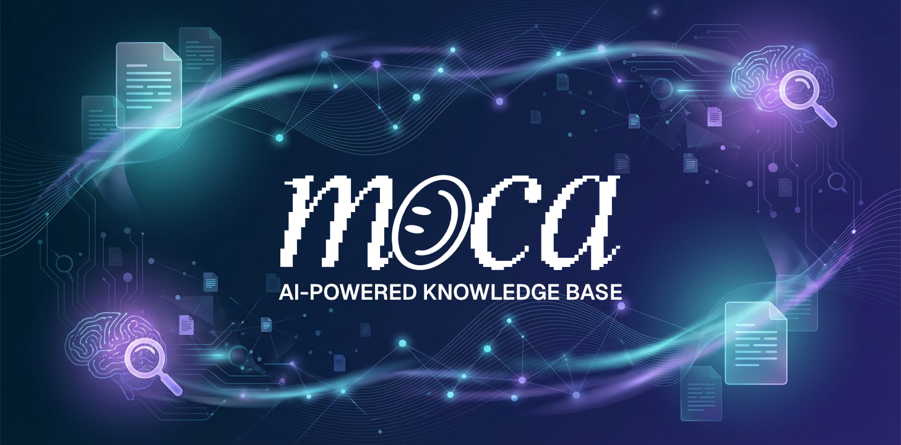

# Cortex

**Institutional memory for the agentic era**


[**Documentation**](https://docs.cortex.eco) · [**Skills for Agents**](https://cortexskills.org) · [**Quickstart**](https://docs.cortex.eco/quickstart)

</div>

## What is Cortex?

**Cortex** is institutional memory for the agentic era. A self-hosted knowledge base that humans and agents read, write and reason over together effectively forming the collective memory layer of your AI stack. Knowledge is synced from every source your organization produces: documents, repositories and connected apps.

LLM-assisted workflows extract the entities and relationships between them into a **scalable knowledge graph** that grows smarter with every source you add. Everything can be queried through a REST API, TypeScript SDK, and MCP to be leveraged by any agent and app you are running.

<p align="center">
  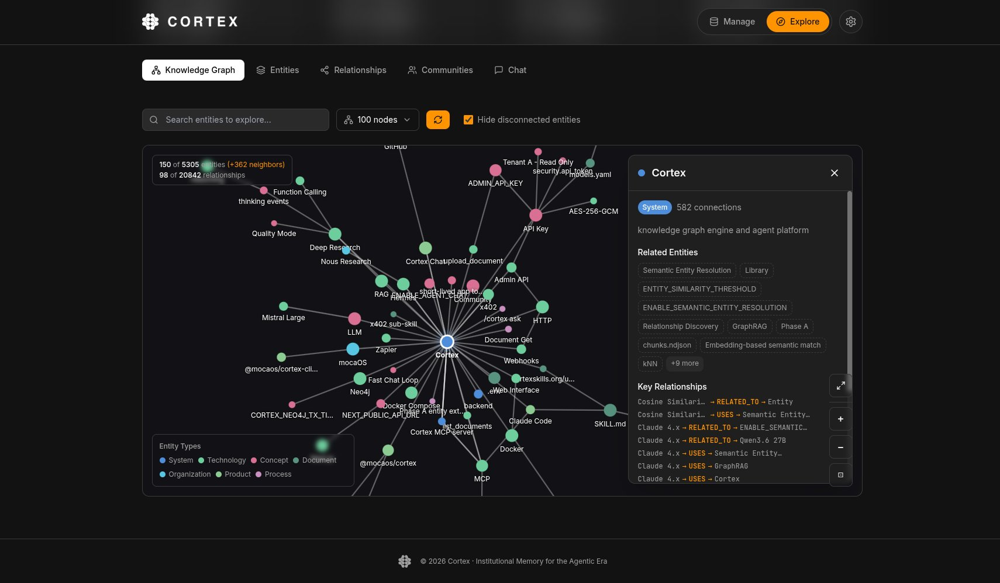
  <br />
  <sub><i>The knowledge graph, explorable: search entities, expand neighborhoods, and inspect any node's relationships — built automatically from your documents.</i></sub>
</p>

Think about where memory lives in your AI stack:

| Layer | Memory | Scope |
|-------|--------|-------|
| Context window | **Short-term** | Doesn't survive the session |
| Agent harness | **Persistent** | Personal memories of that agent |
| **Cortex** | **Collective** | Every person, agent, and app in your organization |

<p align="center">
  
  
  <br />
  <sub><i>Cortex Chat — a lean, multi-tenant chat frontend for end users: assistant presets, Chat & Deep Research modes, and inline citations on every answer.</i></sub>
</p>

### Your knowledge is the moat

Frontier models are a commodity, your competitors call the same APIs you do. What can't be bought is what your organization knows: the decisions, discussions, documents, code, and culture that never made it into anyone's training set. Cortex turns that into a queryable graph you own and host yourself. The longer it runs, the more sources it syncs, the more people and agents enrich it, the wider the moat gets.

And the moat is *yours*, not ours. The whole graph is portable by design, Apache-2.0 licensed, allows for full export/import and usage via framework-agnostic API. When a hot new agent framework drops next month, connect your existing knowledge graph to it and keep going. **Your collective memories move with you.**

<p align="center">
  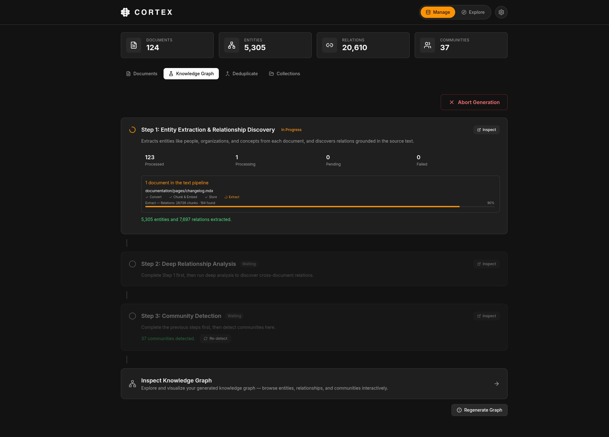
  <br />
  <sub><i>Generating the graph is one click: entity & relation extraction → cross-document deep analysis → community detection, with live per-document progress.</i></sub>
</p>

### Knowledge flows in — automatically

- **📦 Apps** — installable apps sync external systems on a schedule, server-side, with no browser open: **SharePoint**, **Google Drive**, **Dropbox**, **OneDrive**, **Nextcloud**, paperless-ngx, YouTube transcripts, and more. Install from the public [app registry](https://github.com/mocaOS/cortex-registry), or build a connector for your own stack from the [app template](https://github.com/mocaOS/cortex-app-template).
- **🔗 Git integration** — GitHub, GitLab, and Gitea repositories (including self-hosted) stay in sync incrementally via git history, on manual or scheduled polling.
- **🌐 Web Import** — scrape websites via the [crawl4ai](https://github.com/unclecode/crawl4ai) integration: turn any URL into clean Markdown and ingest it straight into the graph. See the [Web Import guide](handbook/23-web-import.md).
- **📁 Uploads & API** — PDF, EPUB, Office, HTML, Markdown, images (OCR), audio (ASR), plus file-less Q&A pairs and freeform text; bulk upload with progress tracking, and outbound webhooks that confirm every ingestion.

<p align="center">
  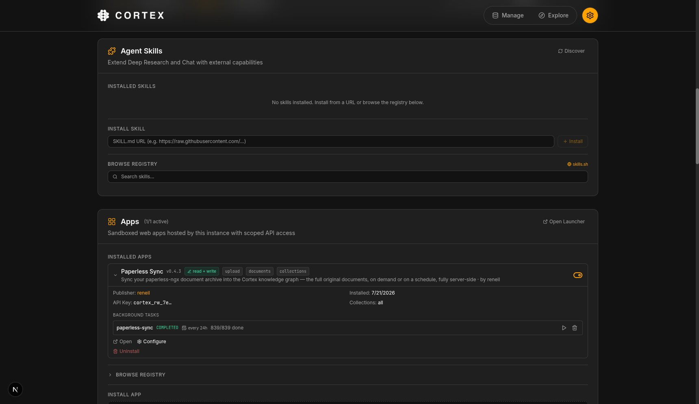
  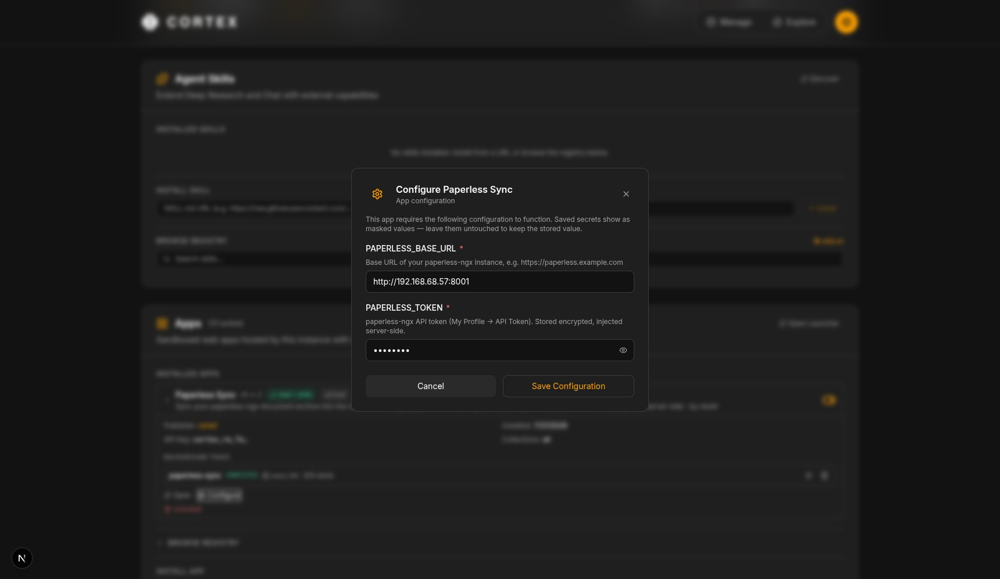
  <br />
  <sub><i>Install a sync app and configure it in place — secrets are stored encrypted and injected server-side, never exposed to the browser.</i></sub>
</p>

<p align="center">
  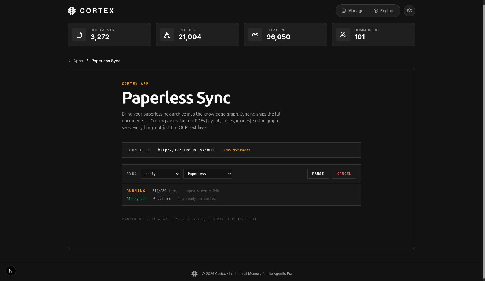
  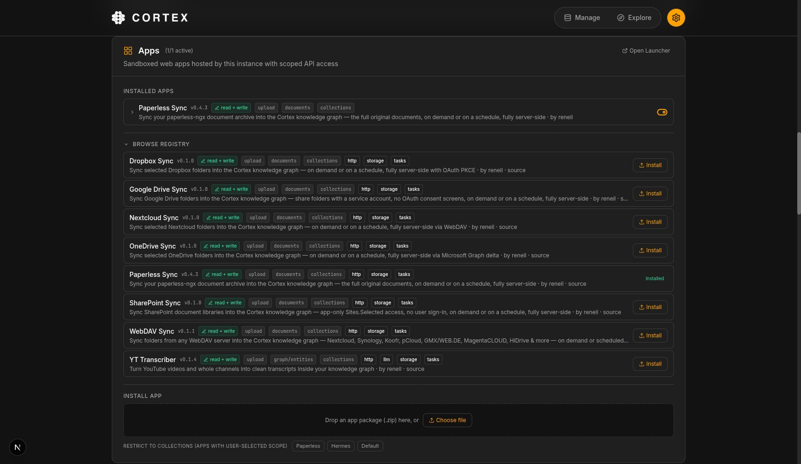
  <br />
  <sub><i>Syncs run server-side on a schedule — no browser open — and more connectors install with one click from the public app registry.</i></sub>
</p>

<p align="center">
  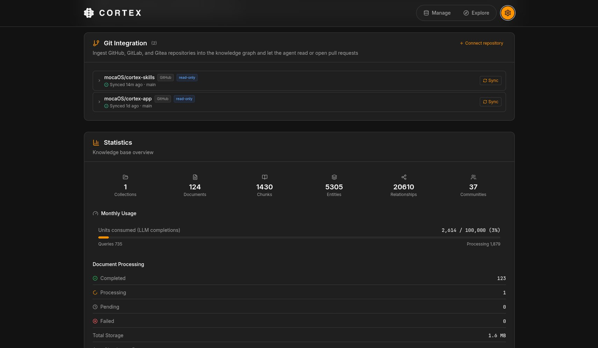
  <br />
  <sub><i>Connected git repositories stay in sync incrementally, while Settings tracks the whole knowledge base at a glance — documents, chunks, entities, relationships, and usage.</i></sub>
</p>

### …and out into everything you run

- **🔌 REST API** — everything the UI does is an endpoint; collection-scoped keys isolate tenants on a single instance.
- **🧰 TypeScript SDK** — [`@mocaos/cortex-client`](https://www.npmjs.com/package/@mocaos/cortex-client): unified ask (`fast|standard|deep`), SSE streaming, conversation threads, uploads, webhooks.
- **🤖 MCP** — [`npx @mocaos/cortex-mcp`](https://www.npmjs.com/package/@mocaos/cortex-mcp) locally, or the instance-hosted remote MCP at `/mcp` — one URL any MCP-capable agent connects to.
- **🧩 Agent skills** — [cortexskills.org](https://cortexskills.org) serves ground-truth `SKILL.md` files so agents drive the API correctly on the first try; [Hermes](https://nousresearch.com) and [OpenClaw](https://docs.openclaw.ai) plug Cortex in as a persistent memory backend.
- **💸 x402 payments** — optionally sell slices of your graph: agents pay per query in stablecoins, revenue flows straight to your wallet.

## Self-hosting

```bash
npx @mocaos/cortex
```

Interactive installer — checks your environment, validates your LLM
credentials before writing anything, then pulls pinned images and starts the
stack. Docker with Compose v2 is the only prerequisite. See
[Quick Start](#quick-start) below for what it does and the two `npx` gotchas,
[handbook/26-self-hosting.md](handbook/26-self-hosting.md) for the full
walkthrough, or [selfhost/README.md](selfhost/README.md) for the manual path.

## The Cortex Ecosystem

This repository is the core of Cortex — the backend, knowledge graph pipeline, and management UI. A family of companion projects builds on the same REST API your own agents and apps use:

| Repository | What it is |
|------------|-----------|
| [**cortex-chat**](https://github.com/mocaOS/cortex-chat) | Lean, multi-tenant chat frontend for end users. Email/password auth, user & group management with group-scoped collection access, streaming Ask AI + Deep Research, inline citations, document upload, and runtime branding — all on top of any Cortex instance via scoped API keys. |
| [**cortex-skills**](https://github.com/mocaOS/cortex-skills) | The knowledge layer between AI agents and Cortex. Curated `SKILL.md` files (served at [cortexskills.org](https://cortexskills.org)) that agents fetch via HTTP to get ground-truth knowledge about the Cortex API — so they build correct integrations on the first try instead of hallucinating endpoints. |
| [**cortex-registry**](https://github.com/mocaOS/cortex-registry) | The public app catalog: git-native, PR-moderated, metadata-only. Listings pin release artifacts by sha256, CI re-verifies them continuously, and instances install from it via the admin **Browse Registry** panel — with an independent checksum verification before anything is unpacked. First-party sync apps for SharePoint, Google Drive, Dropbox, OneDrive, Nextcloud, WebDAV, and paperless-ngx, plus a YouTube transcriber. |
| [**cortex-explorer**](https://github.com/mocaOS/cortex-explorer) | Standalone, iframe-ready knowledge graph visualizer. 2D/3D force-directed graph with entity search, click-to-expand neighborhood traversal, spaceship-style 3D flight, and an accent-derived palette — a single static bundle pointed at any Cortex backend with a read-only key. |
| [**cortex-videogen**](https://github.com/mocaOS/cortex-videogen) | Generates marketing videos (16:9 or 9:16 MP4) from your knowledge base. Cortex research grounds a retention-first storyboard you review and approve; AI footage (Venice.ai), gapless narration, burned-in karaoke captions, a color grade and a CTA end card are then assembled into a publish-ready master + social copy. Storyboard and cost gates keep a human in control of every dollar. |
| [**cortex-trainings**](https://github.com/mocaOS/cortex-trainings) | Turns a knowledge base into interactive training units. An agent researches your instance and writes a complete curriculum — levels, scripts, quizzes, cited sources — which you approve as a plain document before any media is generated; then it produces AI video, voiceover, beat-synced animations and gamified interactions into a single offline HTML file. Reads any Cortex instance with a read-only, collection-scoped key. |
| [**@mocaos/cortex-client**](https://www.npmjs.com/package/@mocaos/cortex-client) | The official TypeScript SDK — unified ask (`depth: fast\|standard\|deep`), SSE streaming, conversation threads with server-curated memory, uploads, collections, webhooks. The MCP server ([`npx @mocaos/cortex-mcp`](https://www.npmjs.com/package/@mocaos/cortex-mcp)) is built on it. |

<p align="center">
  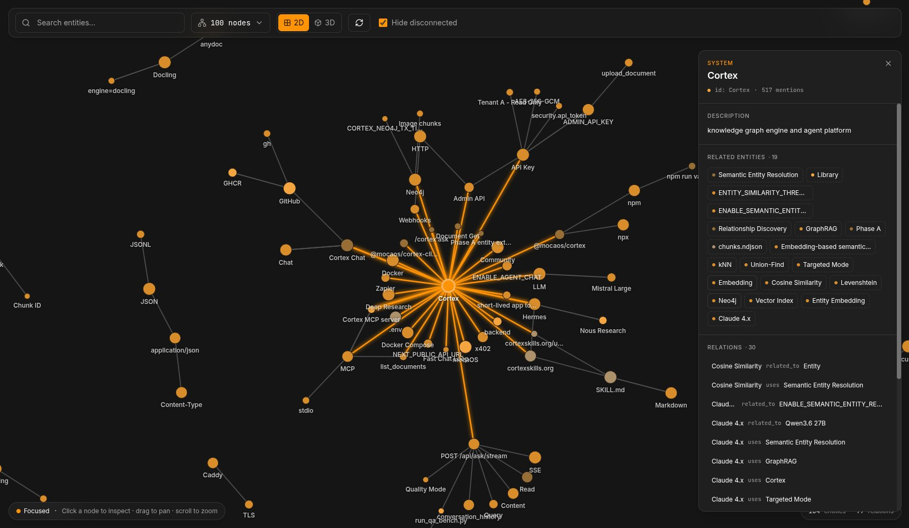
  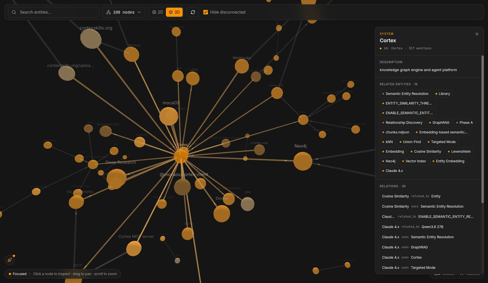
  <br />
  <sub><i>Cortex Explorer — the standalone, iframe-ready graph visualizer: the same knowledge graph in 2D or 3D, with search and click-to-expand traversal.</i></sub>
</p>

## Features

### Core Features
- **📁 Document Upload**: Broad format support — PDF, EPUB, Office (Word/Excel/PowerPoint), HTML/XML, Markdown/text/LaTeX, images (OCR), and audio (ASR) — via a millisecond anydoc fast path with Docling fallback for scans and OCR, with source tracking for API integrations
- **✏️ Custom Inputs**: Manually add Q&A pairs, text, or markdown without file uploads
- **🌐 Web Import**: Scrape web pages into clean markdown and ingest them into the graph via the crawl4ai integration. Paste URLs or **discover** the links on a page and pick which to pull. Cortex never embeds a browser — it calls a self-hosted or shared [crawl4ai](https://github.com/unclecode/crawl4ai) service over HTTP, so one crawler instance serves many deployments. Off by default (`ENABLE_WEB_CRAWL=true` + `CRAWL_SERVICE_URL`).
- **🔍 Hybrid Search**: Semantic + keyword search with Reciprocal Rank Fusion (RRF)
- **💬 AI Q&A**: Ask questions and get AI-generated answers with cited sources
- **🔗 Graph Storage**: Documents stored as interconnected nodes in Neo4j
- **⚡ Vector Search**: Fast similarity search using Neo4j's vector index
- **🎨 Modern UI**: Beautiful, responsive interface with unified navigation:
  - **Manage**: Documents, Knowledge Graph (one-click "Generate Graph" pipeline: entity extraction & relation discovery → cross-document deep relationship analysis → detect communities; "Regenerate Graph" deletes all communities, cross-document relations, and entities for a from-scratch rebuild while preserving per-chunk relations during Step 2 rebuild), Entity Deduplication, Collections, Add
  - **Explore**: Knowledge Graph, Entities, Relationships, Communities, Deep Research, Chat

<p align="center">
  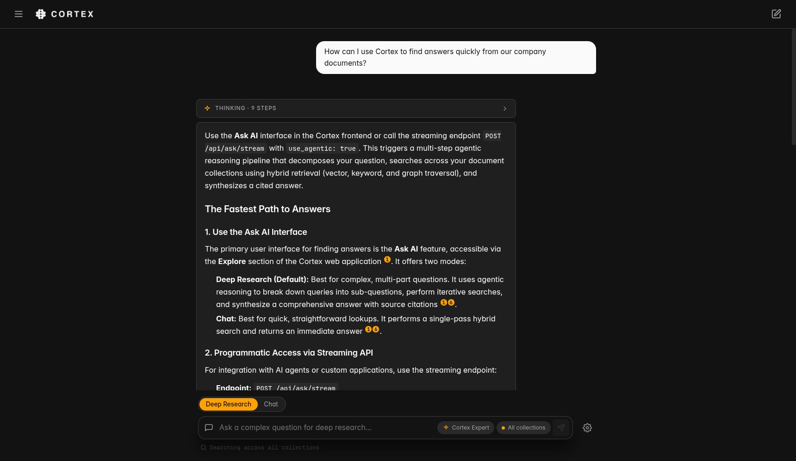
  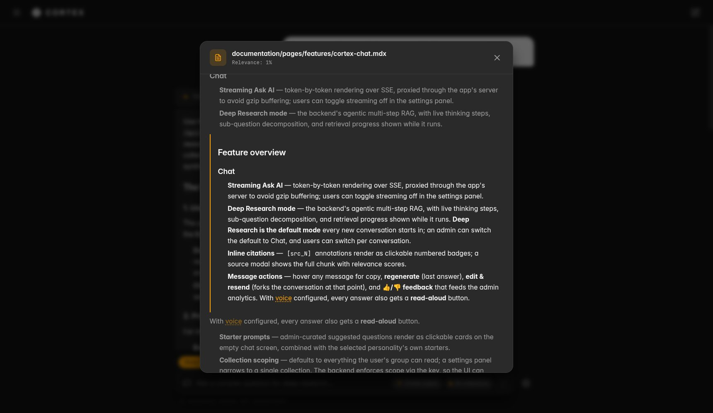
  <br />
  <sub><i>Answers arrive with inline citations — and every citation opens the underlying source, so any claim can be verified in one click.</i></sub>
</p>

### GraphRAG Features
- **🧠 GraphRAG**: LLM-powered entity extraction with per-chunk relationship extraction during ingestion (with retry and exponential backoff for rate limits, canonical name remapping, and self-referential filtering), plus cross-document deep relationship analysis — default `targeted` mode generates candidate pairs without the LLM (entity-embedding kNN + document co-mention) and verifies them in small batched LLM calls; legacy `llm_scan` mode runs the two-phase full-batch scan (candidate scanning with few-shot examples → confidence-scored XML extraction) — for knowledge graph construction. Stats endpoint returns `per_chunk_relationship_count` separately so the UI can distinguish Step 1 relations vs cross-document relations. Dedicated relationship model with separate rate limiting from entity extraction (fallback: relationship → extraction → primary).
- **🔄 Hybrid Retrieval**: Combines vector similarity, keyword search, and graph traversal
- **🎯 Re-ranking**: Cross-encoder re-ranking for improved precision
- **💭 Conversation Memory**: Multi-turn conversations with context retention
- **🚀 Streaming Responses**: Real-time answer generation with SSE
- **🔬 Deep Research Mode**: Agentic multi-step RAG for complex questions

### Advanced Features
- **🌐 Community Detection**: Automatic grouping of related entities using Leiden/Louvain algorithms with weight-aware, undirected graph projection and co-mention edges
- **📝 Community Summarization**: LLM-generated summaries for entity communities using the extraction model, with assistant prefill for reliable JSON output
- **🔮 Extended Thinking**: Visible reasoning chains during agentic RAG (stream thinking)
- **📂 Collection-Level Graphs**: Organize documents into collections with scoped knowledge graphs
- **🎯 Semantic Entity Resolution**: Embedding-based vector similarity deduplication (with Levenshtein 85% fallback) during entity extraction with alias tracking and proper document provenance tracking (`source_documents`, `extraction_count`) — catches semantic matches like "Massachusetts Institute of Technology" / "MIT" that string similarity misses
- **🔀 Entity Deduplication**: Post-extraction duplicate scanning using multi-strategy fuzzy matching (rapidfuzz) with Person-aware name gating (word-prefix validation prevents false matches on shared first names), entity-level deduplicate button in Explore for quick access, inspect modal for reviewing entity details before merging, LLM-generated combined descriptions, review-and-merge UI, inline entity search, and full merge history with audit trail
- **🔄 Targeted Relationship Discovery**: Default Step 2 engine (`RELATIONSHIP_DISCOVERY_MODE=targeted`) generates candidate entity pairs without the LLM — entity-embedding kNN over a Neo4j vector index (missing embeddings backfilled automatically) plus document co-mention — then verifies them in small batched LLM calls (~40 pairs/call), scaling efficiently on large graphs. Legacy `llm_scan` mode keeps the multi-round full-batch scan (up to `RELATIONSHIP_MAX_ROUNDS` rounds, stopping early at the target Entity-Relationship Ratio). Anti-hub protections in both modes: per-entity relationship cap (`RELATIONSHIP_MAX_PER_ENTITY`), candidate caps and doc-frequency hub guard (targeted), degree-aware batching and evidence-based prompts (legacy). Supports incremental (build on existing) and rebuild (delete cross-document relations, preserving per-chunk relations) modes.
- **📈 ERR Metric**: Entity-Relationship Ratio displayed on the Knowledge Graph page (2 decimal places) with color-coded health indicator
- **📊 Explore Browsers**: Entities, relationships, and communities browsers load all items for full-dataset search, with type filters and detail modals
- **⏱️ Progress Tracking**: Real-time batch progress with ETA for relationship analysis and community detection
- **📤 Library Import/Export**: Export your entire library (documents, knowledge graph, embeddings, communities) as a portable ZIP archive and import it into another instance — no need to re-run the expensive knowledge graph pipeline
- **🧩 Agent Skills**: Extend Deep Research and Chat with live API connections from the open [AgentSkills](https://agentskills.io/) ecosystem. Install skills from [skills.sh](https://skills.sh) or direct URLs — a setup wizard auto-detects required configuration (API tokens, etc.) and prompts you to provide them. Enabled skills are automatically activated at the start of every session. The researcher agent uses the built-in `http_request` tool to call external APIs described in skill instructions, with authentication injected server-side from stored configuration.
- **🔗 Git Integration**: Connect **GitHub, GitLab, and Gitea** repositories (including self-hosted) as a living knowledge source. Cortex ingests a repo's files and wiki into the knowledge graph and keeps them in sync **incrementally** via git history (added / modified / deleted / renamed), with a curated `.pdf`/`.md`-only default and custom glob filters. The whole connector is **off by default** — an admin turns it on with `ENABLE_GIT_INTEGRATION=true`, which enables ingestion *and* the agent capability. Each connection is then **read-only (ingest)** unless you grant **read/write**, in which case the research agent gains a `git_repo` tool that opens **pull requests** for your review (never a direct push). Per-connection access tokens, manual or scheduled sync.
- **💸 x402 Payments**: Monetize your knowledge base with pay-per-query **agentic micropayments** via the open [x402 standard](https://github.com/x402-foundation/x402). Free member keys keep working as before; in parallel, mint **monetized public keys** that agents pay per retrieval query in stablecoins (e.g. USDC on Base or Solana), with revenue flowing straight to a wallet you control — subsidize your members' inference and amortize your infra. **Two-tier pricing built in**: quick asks and search bill the key's flat rate, agentic deep research bills `price × multiplier` (default 10×, set per key with a live preview, quoted in the 402 challenge before an agent signs). Vendor-agnostic (any spec-compliant x402 facilitator), configured and **verified** entirely in the admin UI behind a single `X402_ENABLED=true` flag. Monetized keys are read-only, retrieval-endpoints-only, and collection-scopable — sell exactly the slice of knowledge you choose. See the [x402 Payments guide](documentation/pages/features/x402-payments.mdx).
- **📦 Apps**: Install self-contained web apps that run **inside** your instance — build them from the [Cortex App Template](https://github.com/mocaOS/cortex-app-template), package as a zip, and upload in **Settings → Apps**. Each app is served sandboxed under `/apps/{id}/` and reaches the Cortex API only through a proxy that enforces the app's declared endpoint allowlist and attaches a **dedicated minted key** (read or read-write, collection-scopable) — the browser never holds a real credential. **Platform apps** add server-side capabilities: `http` calls to external software (e.g. paperless-ngx) with secrets injected server-side and **no CORS setup on the target**, a quota-capped per-app `storage` store, an `llm` capability metered like any other completion, and `tasks` — declarative step-queues that run server-side, survive a closed tab, and can repeat on a schedule (a paperless app becomes an hourly sync daemon with no browser open). Install from the public **[app registry](https://github.com/mocaOS/cortex-registry)** with end-to-end sha256 verification, or upload private zips. Mint revocable **share links** to let non-Cortex users open an app without a login. Off by default (`ENABLE_APPS=true`). Building an app? Point your coding agent at [cortexskills.org/builder](https://cortexskills.org/builder/SKILL.md). See the [Apps guide](documentation/pages/features/apps.mdx).

### Security & Performance Features
- **🛡️ Prompt Security**: Layered prompt-injection defense — a query-time ML classifier (**Prompt Guard** / PIGuard), 25+ pattern detectors, untrusted-content fencing, output filtering, and an experimental opt-in ingestion-time scan (`ENABLE_INGESTION_INJECTION_SCAN`, off by default). See the [Security guide](documentation/pages/guides/security.mdx).
- **🔐 Collection-Scoped API Keys**: Restrict API keys to specific collections — one instance, multiple isolated tenants. Both `read` and `read+write` keys support collection scoping. Restricted keys automatically receive filtered results across all endpoints — documents, collections, graph entities, relationships, communities, stats, and search — using the 4-hop `Collection→Document→Chunk→Entity` pattern. Out-of-scope single-resource requests return 403. New collections require explicit access grants.
- **📦 Bulk Upload**: Upload hundreds of files with batch processing and progress tracking
- **📥 Bulk Download**: Download selected documents as a ZIP archive (ZIP64, supports 1000+ files)
- **📊 Background Tasks**: Long-running operations with real-time progress polling
- **🧹 Smart Cleanup**: Automatic task cancellation and complete graph cleanup on document deletion
- **⚡ Efficiency Flags**: chunk-batched relationship extraction (÷~4 LLM calls), UNWIND-batched graph writes, and fulltext dedup prefiltering are default-on (each revertible per stack); Phase-B crash-resume checkpointing, unchanged-document reprocess skip, and provider prompt caching remain opt-in — all bench-validated (see the [configuration docs](documentation/pages/configuration.mdx) and `bench/BASELINE.md`)
- **🩺 Production Operations**: Prometheus `GET /metrics` (admin-protected, incl. disk-headroom gauges), optional JSON logs with `X-Request-ID` correlation, per-key rate limiting, request-body ceilings + free-disk guard (413/507 before memory or disk pressure), background-task state that survives restarts, an optional JSONL audit trail (`ENABLE_AUDIT_LOG`), graceful shutdown with SSE drain, per-service memory caps, a nightly backup sidecar (standalone overlay + built into the Coolify/Dokploy composes), and a **slim torch-free image variant** (`INSTALL_LOCAL_ML=false`) for stacks backed by the shared `cortex-helper`
- **🔭 LLM Observability (optional)**: point `LANGFUSE_*` at a self-hosted [Langfuse](https://langfuse.com) instance to trace every LLM/embedding/vision call (cost, tokens, latency, errors) and group agentic Q&A flows into one trace per request — Venice/OpenRouter included. Env-driven; no keys = no tracing, identical image. Prompt/completion content is **redacted by default** (privacy-first); set `LANGFUSE_LOG_EXTENDED=true` to log full text for debugging. See [`.claude/domain/observability.md`](.claude/domain/observability.md)

## Architecture

```
┌─────────────────┐     ┌─────────────────┐     ┌─────────────────┐
│                 │     │                 │     │                 │
│   Next.js UI    │────▶│  FastAPI +      │────▶│     Neo4j       │
│   (TypeScript)  │     │  Haystack       │     │   (Graph + Vec) │
│                 │     │  (Python)       │     │                 │
└─────────────────┘     └─────────────────┘     └─────────────────┘
```

| Component | Technology | Purpose |
|-----------|------------|---------|
| Frontend | Next.js 16 + React 19 + TypeScript | Document management, graph exploration, Q&A interface |
| Backend | FastAPI + Haystack 2.0 | Document processing, embeddings, RAG |
| Database | Neo4j 5.26 | Graph storage + vector similarity search (4096-dim indexes supported) |
| Embeddings | OpenAI-compatible / sentence-transformers | Convert text to semantic vectors |

## Quick Start

> **🤖 Let your agent do it:** want Claude, Hermes, OpenClaw, or any other agent to install and run Cortex for you? Send it **[cortexskills.org](https://cortexskills.org)** — the `setup` skill contains everything an agent needs to self-host a Cortex from scratch (autonomous install, health checks, troubleshooting) and the feature skills teach it to drive the API correctly afterwards.
>
> **🧠 Agent memory backend:** Cortex doubles as a persistent, shared memory backend for agent runtimes. [Hermes](https://nousresearch.com) is the recommended integration ([cortexskills.org/hermes](https://cortexskills.org/hermes/SKILL.md) — includes a native memory-provider plugin for ambient recall); [OpenClaw](https://docs.openclaw.ai) runs the same skill via the open SKILL.md standard ([cortexskills.org/openclaw](https://cortexskills.org/openclaw/SKILL.md)).

### Prerequisites

- Docker with the Compose **v2 plugin** (`docker compose version` — `apt install docker.io` does not include it)
- An LLM API key (any OpenAI-compatible provider — Venice, OpenRouter, OpenAI, self-hosted vLLM/Ollama). Embeddings can come from a second provider if yours doesn't serve them.

### Install (recommended)

```bash
npx @mocaos/cortex
```

That's the whole thing. The interactive installer runs from prebuilt, version-pinned images — nothing to clone and nothing to build. Cortex Chat — a separate chat front end — is offered as an opt-in during setup and is off by default. It checks your environment, then validates your LLM credentials with a real chat completion and a real embedding call **before** it writes anything or pulls a single image, so a wrong key costs you seconds rather than a 1.6 GB download. Then it configures, pulls, starts, and waits for every service to report healthy before printing your login.

It manages the instance afterwards too — `status`, `doctor`, `logs`, `backup`, `restore`, `update`, `start`/`stop`/`restart`, `uninstall` — so you rarely touch Compose directly. Full walkthrough in [handbook/26-self-hosting.md](handbook/26-self-hosting.md).

> There's no `install` subcommand — `npx` already fetches and runs. If npm answers `ENOVERSIONS`, an `.npmrc` with `min-release-age` is hiding the fresh release; use `npx --min-release-age=0 @mocaos/cortex`. Both are explained [in the handbook](handbook/26-self-hosting.md#when-npx-itself-wont-run-it).

### Build from source

For development, for tracking `main`, or when you want to modify the code:

```bash
git clone https://github.com/mocaOS/cortex-app.git
cd cortex-app

# The recommended config — fill in the secrets block + your API key, done
cp .env.recommended .env
nano .env

docker compose up -d
```

`.env.recommended` ships the bench-validated model stack — **Qwen3.6 35B A3B** as the primary agent model, **Qwen3.6 27B** for knowledge-graph generation and vision, `text-embedding-3-small` embeddings — and leaves everything else on production-tuned code defaults. Set `ENCRYPTION_KEY` so git tokens and skill secrets are encrypted at rest (guidance is in the file). Every other knob is documented in the [Configuration Reference](https://docs.cortex.eco/configuration).

### Either way

| Service | URL |
|---------|-----|
| Frontend | http://localhost:3000 |
| Backend API | http://localhost:8000 |
| Neo4j Browser | http://localhost:7474 |

The installer prints these when it finishes — plus a Chat URL if you chose to install Cortex Chat — and can also put Cortex on a public domain with automatic HTTPS via Caddy instead of localhost.

**Using another provider or your own GPUs?** The [LLM Deployment Templates](https://docs.cortex.eco/llm-templates) have a tested stack for Venice, OpenRouter, and self-hosted setups — including fallback model recommendations and hardware-specific concurrency tuning.

**Local development without Docker** (backend venv + `npm run dev`) is covered in the [Getting Started handbook chapter](handbook/03-getting-started.md).

## Documentation

| Resource | What you'll find |
|----------|------------------|
| [**docs.cortex.eco**](https://docs.cortex.eco) | The documentation site — [Quickstart](https://docs.cortex.eco/quickstart), [LLM Deployment Templates](https://docs.cortex.eco/llm-templates), [Configuration Reference](https://docs.cortex.eco/configuration) (all 160+ env vars), feature guides, and the interactive API reference |
| [**cortexskills.org**](https://cortexskills.org) | `SKILL.md` files for AI agents — ground-truth API knowledge for building integrations, self-hosting (`setup`), search, auth, MCP, and more |
| [**cortex.eco/ask**](https://cortex.eco/ask) | Our very own Support Cortex which syncs the Handbook and Documentation folder from this repo into an interactive Q+A interface |

## API

Everything the UI does is available over the REST API. All endpoints except `/health` require an `X-API-Key` header; generated keys carry `read` or `manage` permissions and can be **restricted to specific collections** — enabling multi-tenant deployments from a single instance.

```bash
# Semantic search
curl -X POST http://localhost:8000/api/search \
  -H "Content-Type: application/json" \
  -H "X-API-Key: your-api-key" \
  -d '{"query": "What is machine learning?", "top_k": 5}'

# Ask the Cortex — streaming Deep Research (SSE), the default way to retrieve knowledge
curl -N -X POST http://localhost:8000/api/ask/stream \
  -H "Content-Type: application/json" \
  -H "Accept: text/event-stream" \
  -H "X-API-Key: your-api-key" \
  -d '{"question": "Explain the main concepts", "use_agentic": true}'

# Quick chat answer (non-streaming; bounded by a ~28s server deadline,
# and use_agentic is rejected here with 400 — Deep Research is streaming-only)
curl -X POST http://localhost:8000/api/ask \
  -H "Content-Type: application/json" \
  -H "X-API-Key: your-api-key" \
  -d '{"question": "Explain the main concepts", "use_graph": true, "use_reranking": true}'
```

The surface covers documents & bulk upload, custom inputs, streaming Q&A (SSE, with visible reasoning), graph exploration & visualization, entity dedup & merging, relationship analysis, community detection, collections, background tasks, admin (API keys, usage stats, library import/export, system reset, skills, webhooks), git integration, and web import. Building in TypeScript? Use the official SDK: [`@mocaos/cortex-client`](https://www.npmjs.com/package/@mocaos/cortex-client). See the [API reference](https://docs.cortex.eco/api), [`BACKEND_API_DOCUMENTATION.md`](BACKEND_API_DOCUMENTATION.md), or the OpenAPI spec for the full contract with examples.

## Production Deployment

```bash
docker compose -f docker-compose.prod.yml up -d
```

- **Coolify**: point a Docker Compose project at `coolify/docker-compose.coolify.yml` — see the [Coolify guide](coolify/README.md)
- **Dokploy**: use `dokploy/docker-compose.dokploy.yml` — see [`dokploy/`](dokploy/)
- **Hardening**: set `ENVIRONMENT=production` (fails fast on weak secrets, disables interactive API docs), an explicit `CORS_ALLOWED_ORIGINS`, strong `NEO4J_PASSWORD`/`SESSION_SECRET`/`ENCRYPTION_KEY`, HTTPS via reverse proxy, and block public access to Neo4j ports (7474/7687). No TLS yet (e.g. LAN-only self-host)? Set `SESSION_COOKIE_SECURE=false` or browsers will silently drop the login cookie over plain HTTP
- **Backups**: the prod overlay and both PaaS composes include a nightly backup sidecar with verified server-side graph export, retention that never deletes the newest complete backup, a staleness healthcheck, and a tested `/restore.sh <timestamp>` runbook

The [Deployment guide](https://docs.cortex.eco/guides/deployment) covers all of this in depth.

## Supported File Types

All formats are unified into structured Markdown before chunking and extraction, by one of two engines: **anydoc** (in-process, no ML — office documents and text-based PDFs in milliseconds, so even full-length books convert in under a second) with automatic fallback to **Docling** (locally or via the shared `cortex-helper` service) for everything that needs layout analysis or OCR — scanned/image-rich PDFs, images, audio, HTML, LaTeX:

| Type | Extensions |
|------|-----------|
| PDF | `.pdf` |
| E-books | `.epub` |
| Office | `.docx`, `.doc`, `.xlsx`, `.xls`, `.pptx`, `.ppt` |
| Web / markup | `.html`, `.htm`, `.xml` |
| Text | `.txt`, `.md`, `.mdx`, `.markdown`, `.rst`, `.tex`, `.latex` |
| Images (OCR) | `.png`, `.jpg`, `.jpeg`, `.tiff`, `.tif`, `.bmp` |
| Audio (ASR) | `.wav`, `.mp3`, `.webvtt`, `.vtt` |

Knowledge can also be added without files — Q&A pairs, freeform text, and markdown go through the same GraphRAG pipeline as uploads.

## Testing

The backend suite is fully hermetic — LLM, Neo4j, and the ML stack are mocked in `conftest.py`, so it runs with no external services. The system Python has no pytest; create a torch-free venv from the base requirements:

```bash
# Backend unit/contract suite
cd backend
python3 -m venv .qa-venv
.qa-venv/bin/pip install -r requirements-base.txt    # torch-free; includes pytest
.qa-venv/bin/python -m pytest -q
.qa-venv/bin/python -m ruff check --select E9,F63,F7,F82 app/ tests/   # CI lint gate

# Frontend gate (no test runner — type-check + lint)
cd frontend
npm ci
npx tsc --noEmit
npm run lint
```

**Live end-to-end journeys** (`backend/tests/test_live_e2e*.py`) run real HTTP requests against a running stack and auto-skip when none is reachable. Authenticated journeys read the key from `CORTEX_E2E_API_KEY` (never hard-coded):

```bash
CORTEX_E2E_API_KEY=<key> .qa-venv/bin/python -m pytest tests/test_live_e2e_authed.py
```

The canonical QA feature/defect inventory lives in [`qa/cortex_qa_master.ods`](qa/) with a written summary in [`qa/QA_REPORT.md`](qa/QA_REPORT.md); see [`.claude/qa.md`](.claude/qa.md) for the full harness reference.

## Releasing

Three repositories ship independently, and all of them release the same way: **push a `vX.Y.Z` tag, nothing else**. Each workflow triggers only on `tags: ["v[0-9]+.[0-9]+.[0-9]+"]`, so a prerelease tag can never publish by accident, and each verifies the tag against its own `package.json` before doing anything irreversible.

| Repo | A tag produces | How users get it |
|---|---|---|
| [`cortex-installer`](https://github.com/mocaOS/cortex-installer) | `npm publish` with provenance + GitHub release | `npx @mocaos/cortex` immediately |
| `cortex-app` (this repo) | multi-arch backend + frontend images on GHCR, release with `stack.json` | `npx @mocaos/cortex update` |
| [`cortex-chat`](https://github.com/mocaOS/cortex-chat) | chat image on GHCR | only through a `cortex-app` release that re-pins it |

### Installer patch

```bash
npm version patch        # bumps package.json, commits, tags
git push --follow-tags
```

The workflow re-runs typecheck, tests and build before publishing.

### This repo's patch

The root `package.json` version is the source of truth, and **four files must move together**: `frontend/package.json`, both `CORTEX_*_IMAGE` tags in `selfhost/.env.example`, and `CORTEX_VERSION` in `backend/app/main.py` (what `GET /health` reports). `scripts/check-version-sync.mjs` enforces it — in CI on every push, and again in the release workflow as the last gate before an irreversible publish.

```bash
npm version patch --no-git-tag-version              # bumps the root only
# bump the other three to match, then:
node scripts/check-version-sync.mjs --tag v1.0.2    # must print "Versions in sync."
git commit -am "chore: v1.0.2" && git tag -a v1.0.2 -m v1.0.2
git push --follow-tags
```

`npm version` does not propagate to the other three, so that middle step is manual today; the guard is what stops a half-bumped release reaching users.

### Three rules that aren't obvious

- **Release cortex-chat before cortex-app.** `stack.json` pins the chat version and verifies the image is pullable. Chat is pinned in [`selfhost/stack.template.json`](selfhost/stack.template.json) rather than derived from this repo's version, so a chat-only patch ships without rebuilding the ~1.2 GB backend — bump `components.chat` there, then release here.
- **Raise `minInstaller`** in the same file whenever a stack fix only takes effect with newer installer behaviour. It sits at `1.2.2` — raised there because the chat service moved behind a Compose profile, and an older installer never writes `COMPOSE_PROFILES` at all, so it would install this stack with chat silently missing and then time out waiting for it to become healthy (1.2.0 and 1.2.1 are excluded too, for defects found in review on that same path). Before that it was `1.0.2`, because the corrected `ops/backup/restore.sh` reaches the backup sidecar only on an installer that passes `--build` to `compose up` — the sidecar is built locally, and Compose will not rebuild an existing image just because its build context changed. Get this wrong and the fix ships but never applies.
- **A just-published release is invisible to `npx` if you run a publish cooldown.** An `.npmrc` with `min-release-age` set hides every version inside that window, so verifying your own release needs `npx --min-release-age=0 @mocaos/cortex@<version>`. See [handbook/26-self-hosting.md](handbook/26-self-hosting.md#when-npx-itself-wont-run-it).

See [`.claude/development.md`](.claude/development.md) for the full self-host and release reference.

## Tech Stack

### Frontend
- **Next.js 16** - React framework with App Router
- **React 19** - Latest React with improved performance
- **TypeScript 5** - Type safety
- **Tailwind CSS 3** - Styling
- **Framer Motion** - Animations
- **Lucide Icons** - Icon library
- **react-force-graph-2d** - Knowledge graph visualization

### Backend
- **FastAPI** - High-performance Python web framework
- **Haystack 2.0** - AI/NLP pipeline framework
- **sentence-transformers** - Text embedding models (fallback)
- **OpenAI** - Embeddings and LLM generation
- **neo4j-driver 5.x** - Official Neo4j Python driver
- **cross-encoder** - Re-ranking for improved precision

### Database
- **Neo4j 5.26** - Graph database with vector search (Community or Enterprise) — 4096-dim vector indexes supported
- **APOC** - Neo4j procedures library

## License

Licensed under the [Apache License, Version 2.0](LICENSE). You may use, modify, and distribute this project freely — including commercially. The license includes an explicit patent grant from all contributors.

## Contributing

Contributions are welcome! Please open an issue or submit a pull request.

---

<a href="https://museumofcryptoart.com/">
  <picture>
    <source media="(prefers-color-scheme: dark)" srcset="frontend/public/brand/moca_logo_white.svg" />
    
  </picture>
</a>

Built by [MOCA](https://museumofcryptoart.com/) · Follow us on [Twitter](https://twitter.com/MuseumofCrypto/)
